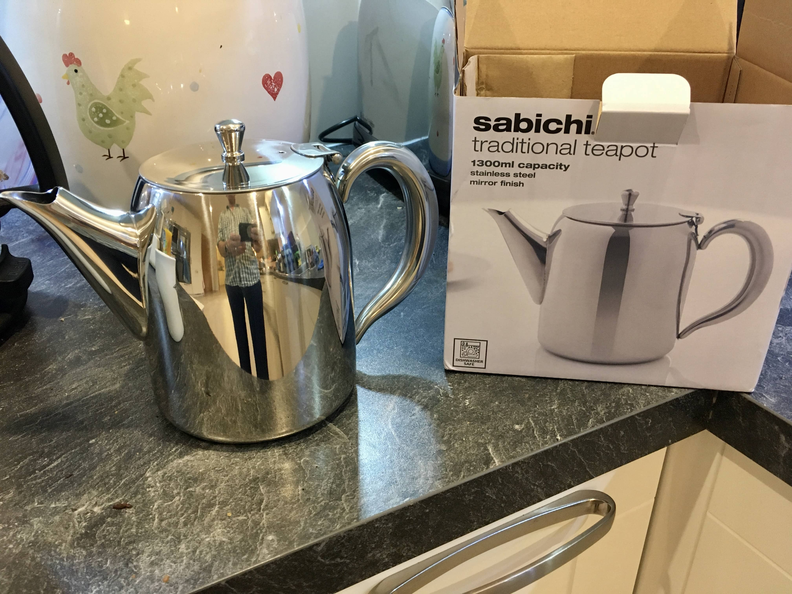
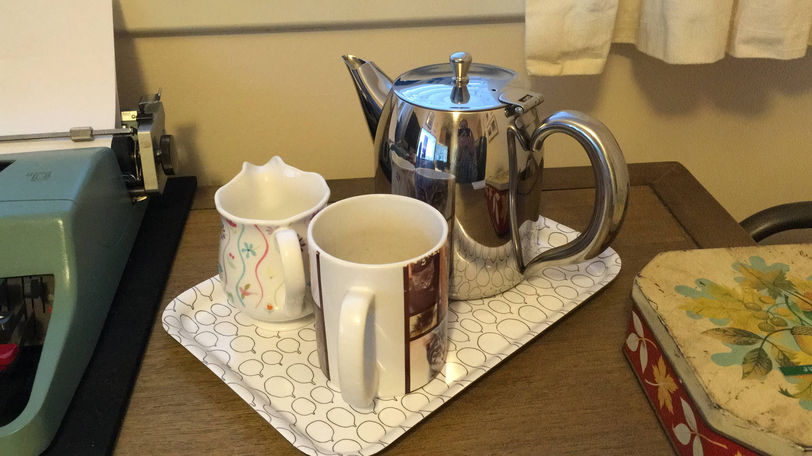
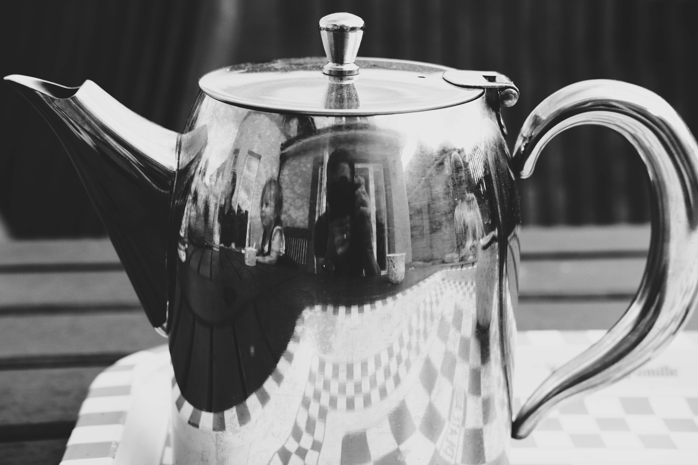

# My favourite teapot 🫖


Yes, I'm very fond of tea.


Like all favourites the real favourite always depends. It depends on the intent, at least for me. I suppose you could do a "of all time" or "best overall" style favourite. I think a common distinction is form over function. There are a lot of things that look great but are practically useless, even if - like a teapot - they should be used, they still may remain annoying.

So having said all that...I present the Sabichi classic stainless steel teapot.

It comes in a variety of sizes 720ml, 1300ml, and 1900ml, so big enough for even the largest tea drinking family. It's also very reasonably priced at £16 for the medium sized one.

So why do I like it so much? It does the job very well: It has good capacity, it has a classic, timeless look and most importantly, it pours well. So many teapots have terrible spouts that drip or splash tea everywhere. I enjoy filling it up with 1.3 litres and then having several good sized mugs of tea. A teapot for one is fine but when visitors are around you don't want to have to decide between a teabag per mug or tiny cups to use the tea pot.

It has been perfect for working at home when the children are also home. I could make a good amount of tea and hide away in the office working, and not be worried about coming out and upsetting whatever is going on because I'm parched.

I just worry that I should maybe buy a spare in case this one breaks...
