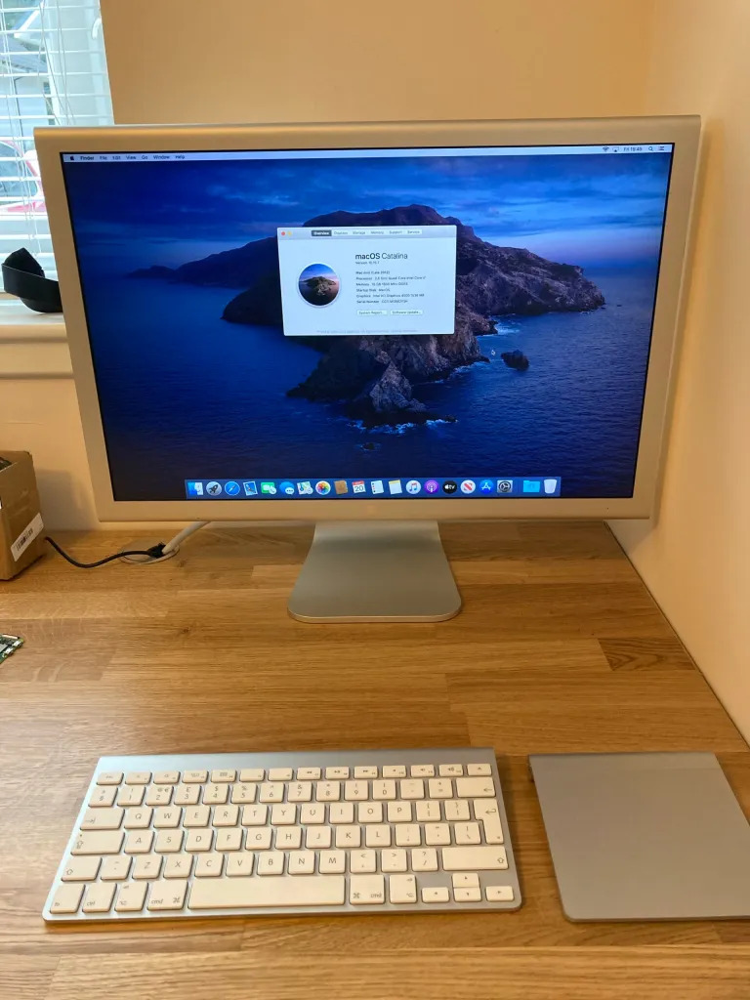
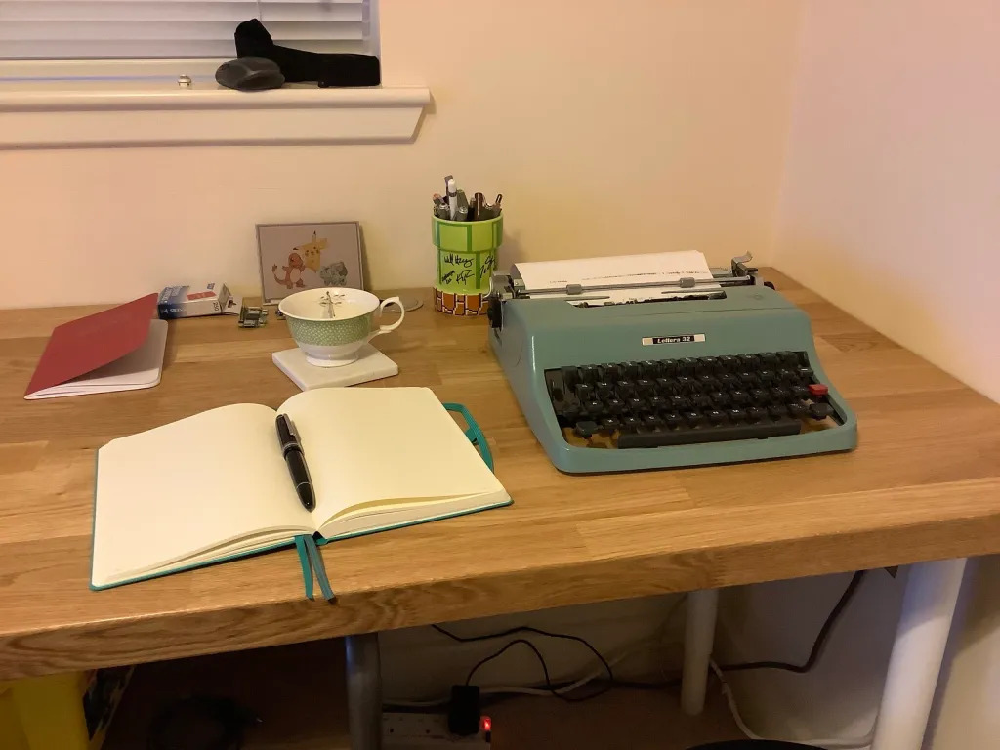
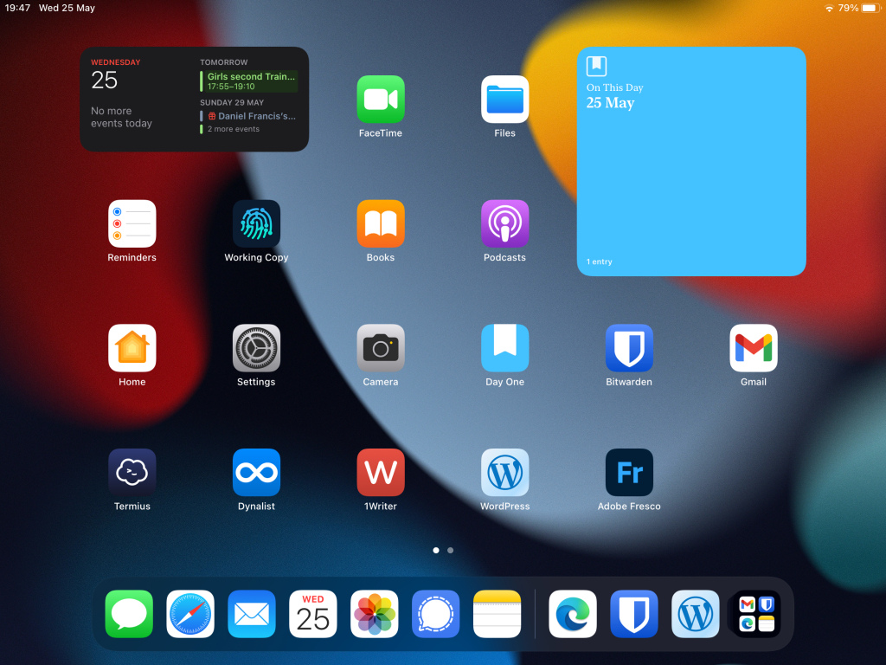
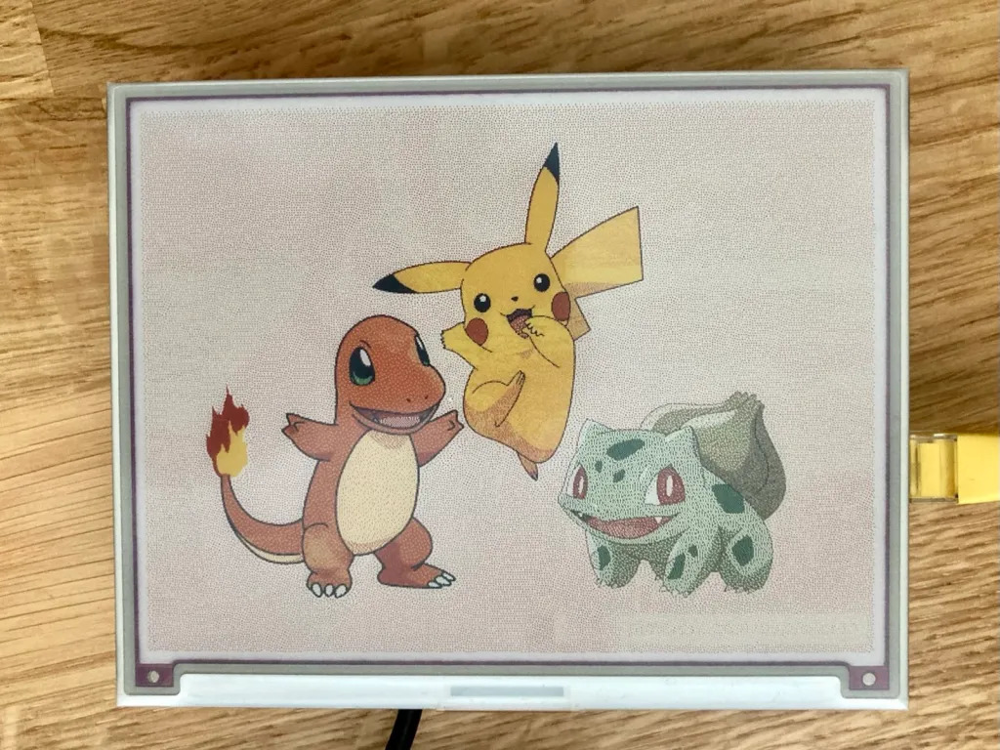

As much as I love computers, it does turn out that you can have too many.

A while back I decided that we needed another computer in the office for  when two people wanted to use a computer at the same time. Sounds  logically right? I managed to pick up a good deal on a Mac Mini. It was a 2012 model but top spec and still very performant today. The only bad  thing is that it’s stuck on an older version of macOS. I even installed a 2 TB SSD so I could manage all our photos on it. I figured it would be  nice to utilise Apple Photos and iCloud and get everything everywhere  and all the moments, and “on this day” etc. that it gives you. It would  also be a nice computer for learning some JavaScript and other general  software dev stuff. The final decider was that I’d then have DayOne on a desktop machine. DayOne being where we keep the family journal.

It turns out that whilst that all may be very true, I’m unable to use a  computer without wasting hours of time looking at random things online,  and not actually accomplishing any of the things I’d told myself were  the very reason I needed to get another computer. Maybe I did them some  of the time but I wasn’t happy with it. I actually had two monitors and  that made the desk look very cluttered as it came out at an angle into  the desk top. Going back to the single monitor did make it look less  overwhelming but it still didn’t change the fact that this extra  computer was really one too many. We have five computers, and three  raspberry pis, and a flock of iPads and Amazon tablets. I could probably manage without it.

So now it’s packed up and ready to be sold (as long as  I’m certain) and the space cleared out. Originally I planned to just use it for paper, whether by pen or by typewriter, but I’ve actually found  it’s a nice spot for the iPad with the Smart Keyboard. I recently had to wipe and reinstall iPadOS as it was having issues and because of the  issues I didn’t want to restore it to how it was and just added apps as I went along. This meant it was quite bare. I tidied up the Home Screen  and am trying to keep it limited in scope. It’s still just as easy to  waste time on Reddit or the internet on the iPad as much as a desktop!

I have my main writing apps with 1Writer, Day One and  WordPress. A few utilities, dynalist for lists, Fresco for my daughter  to draw, and the Day One widget so I actually see some of the older  entries without having to do anything. The second page of the iPad is  some streaming apps and misc. things I use occasionally or if I go away.

Even though I have a web browser, I’m less drawn to it on here than either  dedicated apps or the browser on the desktop. Generally there aren’t  apps on the desktop so it’s always the browser. Just these few small  hurdles to overcome seem to be enough to stop me wasting away time and  actually doing the things I set out to do in the first place.

I  still get sucked into random websites and whatever, either from emails  or links people send me, but it’s usually not the default starting place it tends to be with a desktop. Plus the other fact of when I feel like  pen and paper or typewriter, the iPad is small and easily moved out the  way.

I should sort out my e-ink screen and have something interesting show up on that whilst I sit here.

