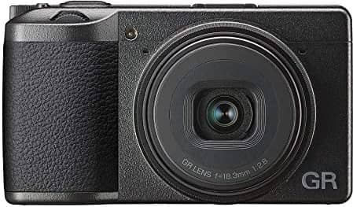

Whilst I'd love to get a Leica Q2 or even a GRIII, they're quite expensive (quite being the  understatement on the Q2). I'm interested in getting a compact camera to just take anywhere without it being a big deal. My Fuji isn't huge but  it's not something that fits in the pocket or near enough. These last  two statements don't really support the Q2 whatsoever - it's not *that* compact and given its price, it'll always be a big deal - but I still want one.

This may be an excuse to buy more camera gear with the weak premise that  it's furfilling some other duty or need but I don't care. Particularly  as I'm trying to find something that is cheap - ideally <£100 but  we'll see.

Two/three that I first found which are quite  interesting are the Olympus Pen E-PM2 (or maybe the 1 but that might be  too old) and the Lumix LX100. These are both micro 4/3s sensors, so a  compromise on sensor size but the benefit of being small. Whilst the  sensor size is smaller than even APS-C, it's still massively bigger than a phone.

The Olympus has an interchangable lens, and so you need to find a pancake lens to keep the size down. It's nearly 10 years old  but still has a respectable sensor. I'm worried I like it as it's then  another money pit for new lenses. I could be fun for small telephoto  lenses but I also don't need them. I'm also concerned that lens creep  would result in ending up with a camera just as big as my X-T2.

The Lumix LX100 looks really like a Fuji, and the lens says Leica. So  what's not to like! It' looks a bit old and, when turned on and the lens comes out, like quite big and unsubtle. However that's not really that  important. They also make a mark ii which has quite a few upgrades but  also higher price. The zoom lens is a handy feature and I like how you  can move between fixed focal lengths (e.g. 24, 28, 35 ...) rather than  just a continous zoom. It's also quite good on video...not that I  generally take much video.

However, once I started this search the flood gates opened and every new camera I'd investigate there'd be 100  comments with 100 new models that everyone recommended as being "much  better". Some of them that I noticed but still to look into are:

- Lecia TL
- Leica CL
- Olympus EP-5
- Olympus pen-F
- Nikon Coolpix A
- Fuji XF10
- Lumix GX9
- Ricoh GR2 / GR3
- Fuji X-E2/2s/3
- Canon EOS M200 and EF-M 22mm f/2
- Lumix GX880
- Lumix GX80

These are becoming way beyond my cheap criteria, and has just become a research distraction.

Then there is also getting a top end iPhone, because I'd always have it.  Although it's £1000 or whatever, and I don't like taking pictures with a phone.
