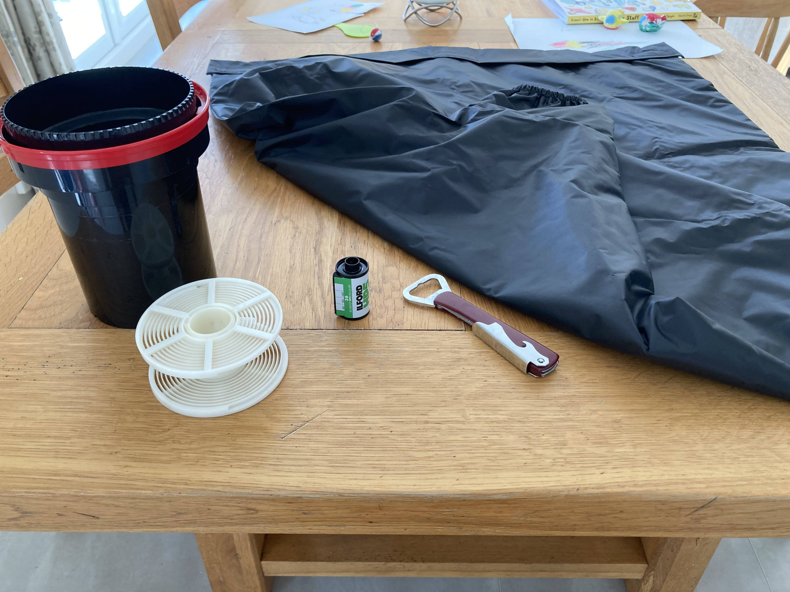
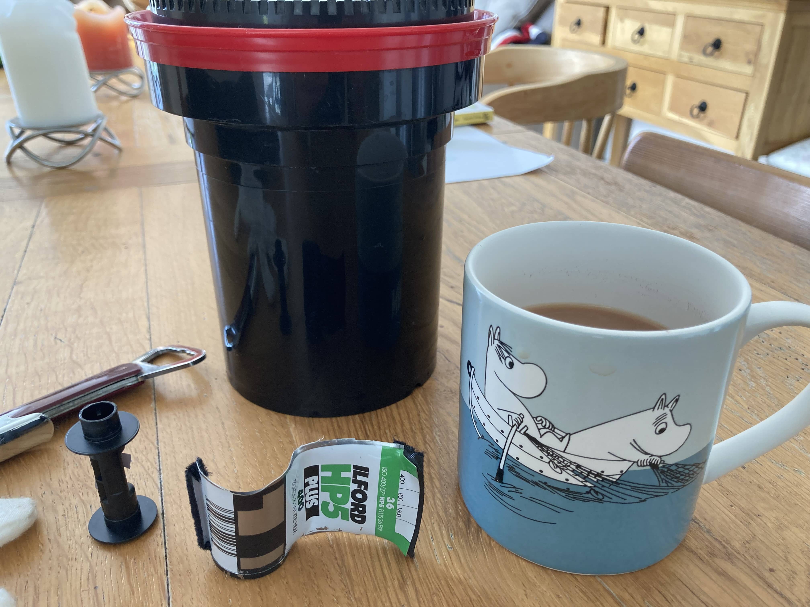
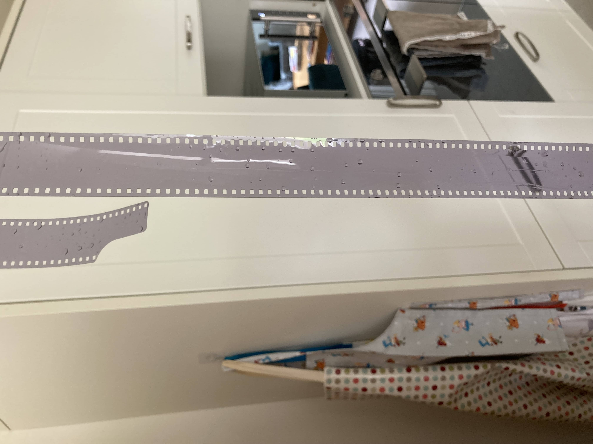
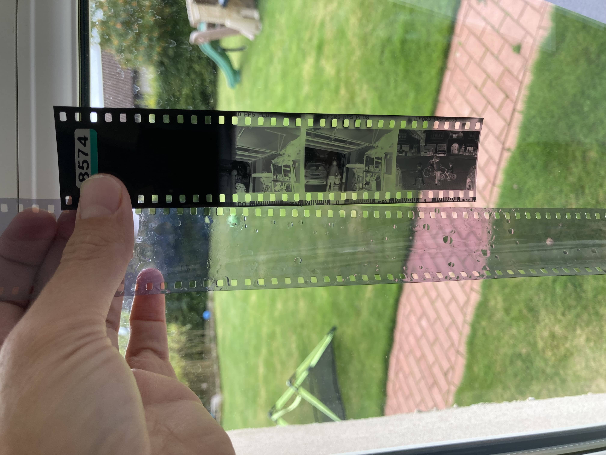

This isn't my first attempt at film development, that was at the beginning of this year with trying out the 4x5 camera. I've been meaning to write about that for 9 months, maybe I'll get to it soon... This was my first attempt at 35mm film though (black and white, obviously). Up to now I've just sent them away to filmdev.co.uk as they do a good job and are competitively priced. Although prices have gone up this year, so not quite as cheap as it used to be. I have thought of using them just for development and then scanning myself to save some money, but why not do the whole thing!


tl;dr: It went badly.


I've had all the stuff since last Christmas when I asked for it from family members - as no-one ever knows what to get for me. Although I don't have a film canister opener. I did try using a bottle opener but it didn't really work. I ended up just ripping the canister apart from the film leader gap. That worked quite well as I could hold the coiled film.

I don't have a dark room, just a dark bag - as you can see - and loading the film into the spool was interesting. I was wearing some gloves to try and stop getting too much finger grease on the film but it was impossible to feel the film and the entrance to the spool. I ended up taking off one glove and then I could feel it better and feed it on to the spool. Once on, it's easy to roll as you just turn the spool back and forth and it loads. It was surprisingly easy to do. I put it into the developing tank. The one I have can hold two spools but I thought I'd just try wrecking one film first (a good choice). I should've put it on the bottom of the tank and the blank on top to minimise the amount of chemicals I need, but I didn't think about it at the time and just put it on the top to make it easier to load.

All ready to develop! It's been 9 months since I last did it, and I realised I had forgotten most of what I needed to do. Some googling and I was all set. I had made some notes on what I did but I have no idea where I saved those as I couldn't find them. I've since made a [cheatsheet page on this site](/film) so I can find it in the future!

At this stage I should've realised something wasn't quite right. See that dark red solution? That's the developer. I need to find my photo of my first development efforts, but as I was pouring it I did think it looked awfully dark. However, I did nothing and carried on regardless. My sister was staying at the time and she came to see what I was up to. She walked in to me saying "1 to 9; 450 ml" as I was trying to figure out the dilution ratios. Maybe it's me but I dislike ratios. Just make it a decimal. 🤓

> I assume the issue was dodgy developer but perhaps there was something else too?

I use the Dev It app on my phone to manage the stages and times. I works pretty well and you can look up what others have used for the same film and solutions. After the developing, stopping, fixing, washing, agitating and timing, I was ready...

My sister looks at it and says: "is that what it's supposed to be like?". COMPLETELY BLANK. lolnope. We laugh a lot. 😂 Then I sighed. None of the pictures were anything special or particular, just the kids and us playing and out and about, but I was looking forward to seeing them. Well another lesson taught with brutal honesty by film

Side story:

At university, I did natural sciences in the first year and one of those was physics. We had labs each week and at some stage we were doing optics, and the lab involved taking photos with a film camera. This was back when I had no idea about anything and just used a point and shoot the whole time. Anyway, I spent 3 hours doing the lab. Setting up things to photograph, changing the distance and aperture etc. I took the whole roll and went into the darkroom. Thinking about it now it seems wild we were just left to get on with the film development with just a piece of paper to explain. After all of that I take out my film and it looks remarkably like the blank one above. Turns out I hadn't loaded it properly and it never wound on. 😢 The moment I took out this film I was reminded of that lab, one afternoon  nearly 20 years ago. This time I know the film wound on, as the M2 has the rewind knob with the two red dots that turn and I reached the end as I couldn't advance the film.

As part of my investigation into why, I got out another roll of HP5 that had been developed. I noticed the leader was perfectly black and the edges have some darkness on it. My film was perfectly clear the whole way. So that can't be right as the leader had also been expose to the daylight. This suggested chemicals was the problem not the camera or loading etc. I get on the signal chat and ask my film development [support team](https://baty.net/). Dodgy developer was the main suspect.

I then take a look at the bottle of developer:

This bottle was opened New Year's Day 2022. Further forum reading suggests darkening is another symptom, particularly bad if it looks like strong tea.

Now strong tea is something I can recognise.

I've ordered some new chemical. Going with Kodak HC-110 this time. It keeps longer and is more economical per roll too, so that's a bonus. I need to take some pictures and then give it another go. Hopefully third time's the charm. Then I can enjoy the other eight rolls of HP5+ I've got waiting.
