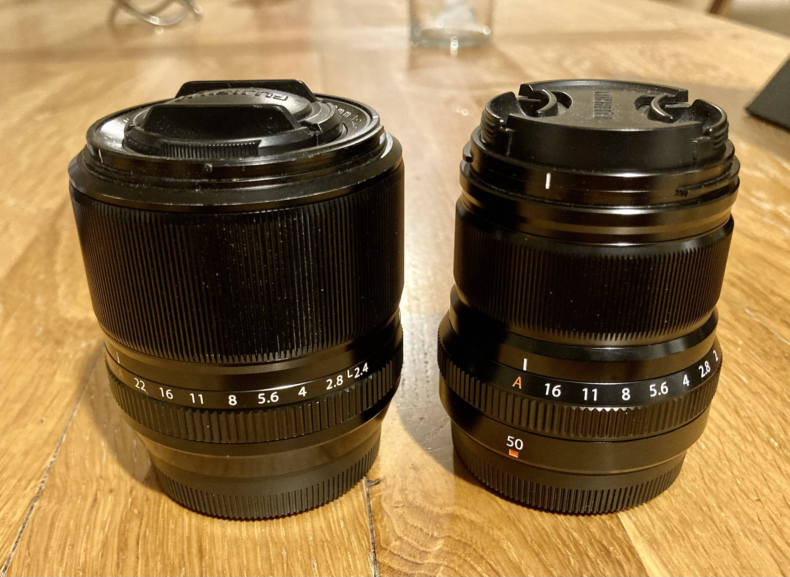
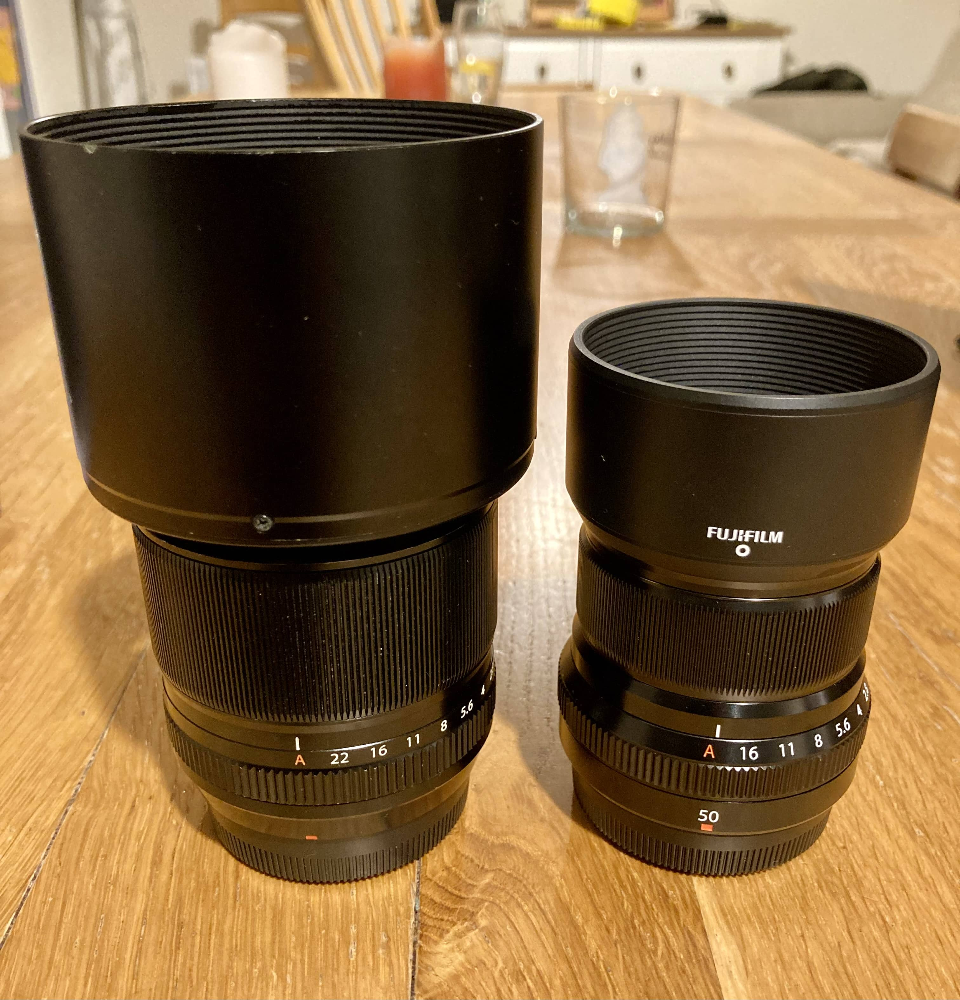
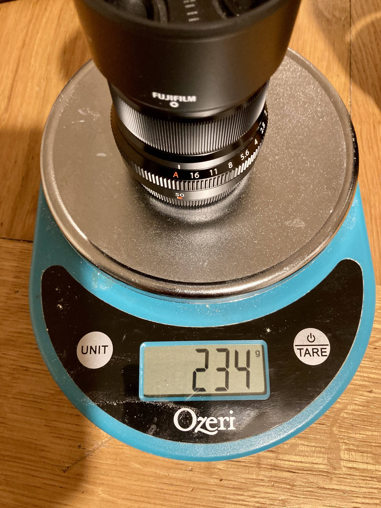
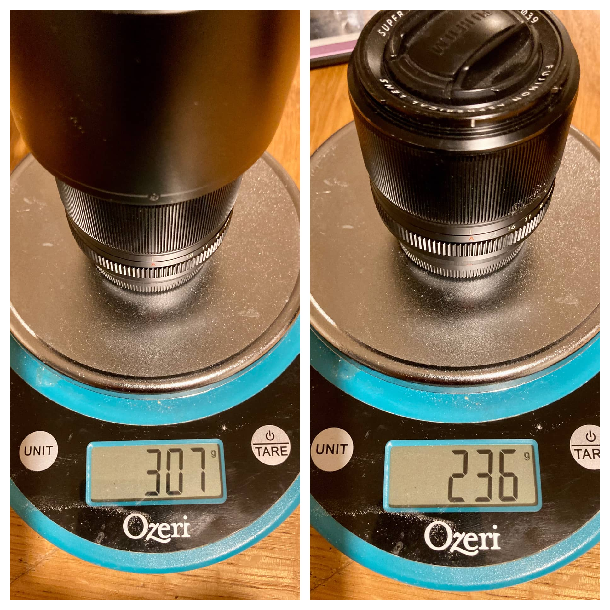


I already sold the 50...


This post sat as a draft for a long time when I was using blot. Whilst migrating my site to this new Hugo one I saw the pictures I took and thought I might as well write it up quickly.

## Background

I ended up with both the 50mm f/2 and the 60mm f/2.4. The first as I wanted a longer lens for when out and about, but still light and quick focusing, and the latter as I started scanning my film with my camera. One day I decided that having both was unnecessary and I went about deciding which one to get rid of.

## Comparison

They're both similar in size and weight, except when you put the massive metal hood on the 60 mm, which adds another 70g, 30% weight of the lens itself! The 60mm must flare badly if it has such a stonking great hood. Does mean you don't always need to carry it with you.

Being 60mm, you do get more subject separation than the 50mm, even with the fraction slower speed. So for portraits - where people are standing still - the 60mm is probably better. It's also of the old, original set of Fuji lenses (along with the [35mm f/1.4]() and the 56 f/1.2), which means it has a slightly different look than the modern ones. Good or bad? That's personal preference. I certainly like the 35mm one.

f/2.4 vs f/2 is not really much different, although I've not done sharpness tests etc., for that you'll have to look elsewhere.

The obvious difference is that the 60mm has close focus for macro - this was the very reason I bought it. I'm not sure 60mm is a great macro length and it's not a perfect 1:1 macro, so YMMV. I'm thinking about replacing mine as for film scanning I can't make use of the full sensor area with this lens, so seems like a waste.

Speaking of focusing...oh my how the 60mm is slow compared to the 50mm. It's not super slow, and perfectly usable even for kids running around but it's not the 🫰 and you're there focus of the 50mm. Having said that, the 50mm often missed focus on kids running around so not perfect either.
