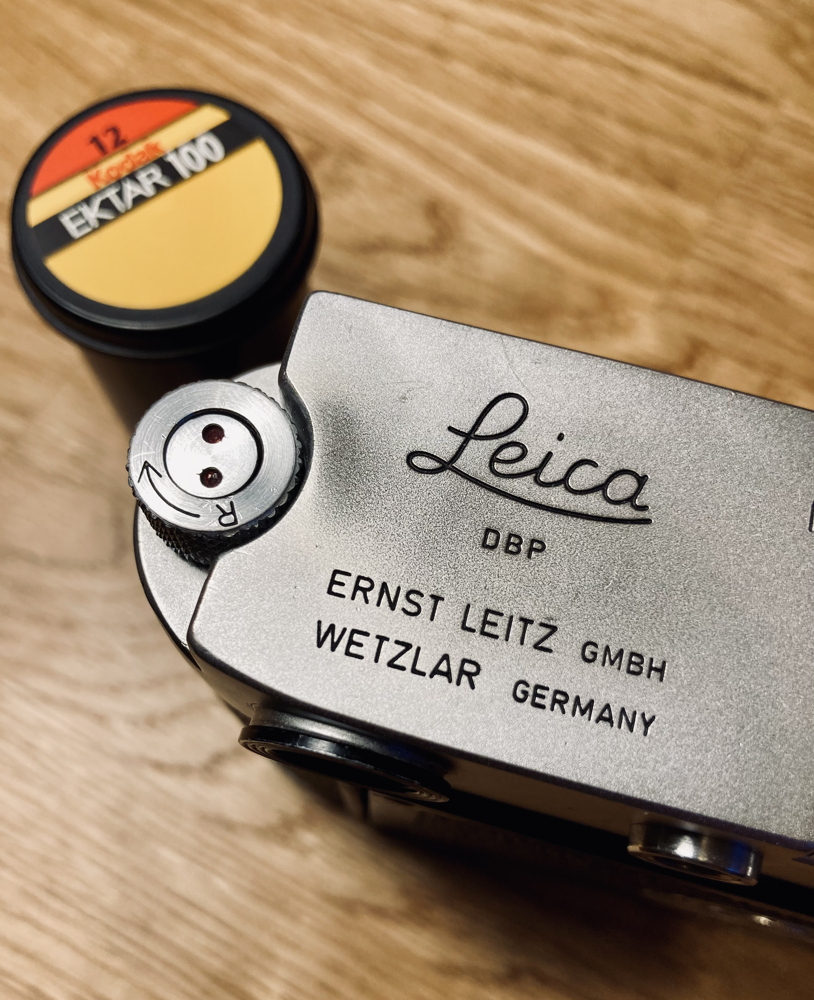
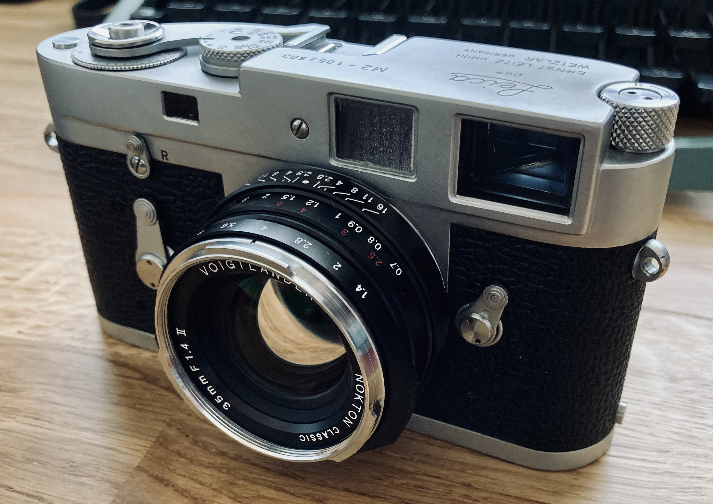

My Leica M2 was made in 1962, according to the [serial number](https://www.l-camera-forum.com/leica-wiki.en/index.php/Serial_Numbers_Leica_Cameras), and it works just as well today as it did when it was first made.

It's my most favourite camera. I love the rangefinder focusing, and the feel and quality of it are outstanding. With a little care and maintenance this camera will last me another 60 years and beyond. My grandfather was a keen photographer and took many photos in his life. Unfortunately not many survived, and certainly none of his cameras. I don't know if he ever had a Leica, I suspect not, but if he did then this could've been his. Even though it has no sentimental value, being from 1962 is the era of the few slide photos I do have from my grandfather, so it reminds me of him that way.

It is just a box, and it's the lenses and film emulsion that truly make the photos, but it's a box that makes you want to keep coming back to take more. I just hope film doesn't become such an expensive luxury that the camera gets used less and less.

