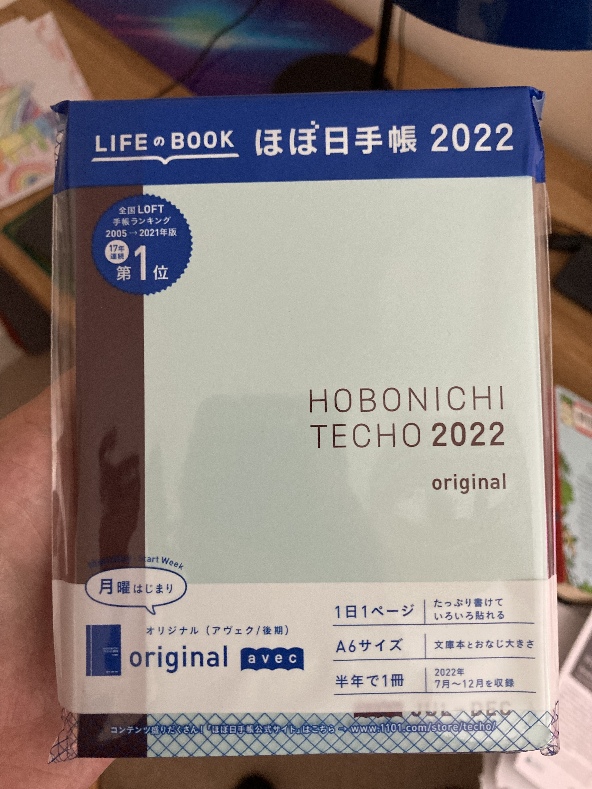
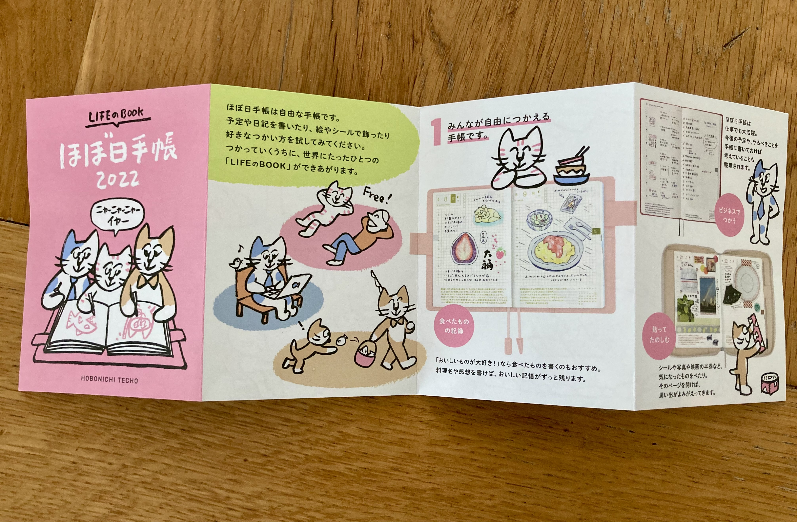
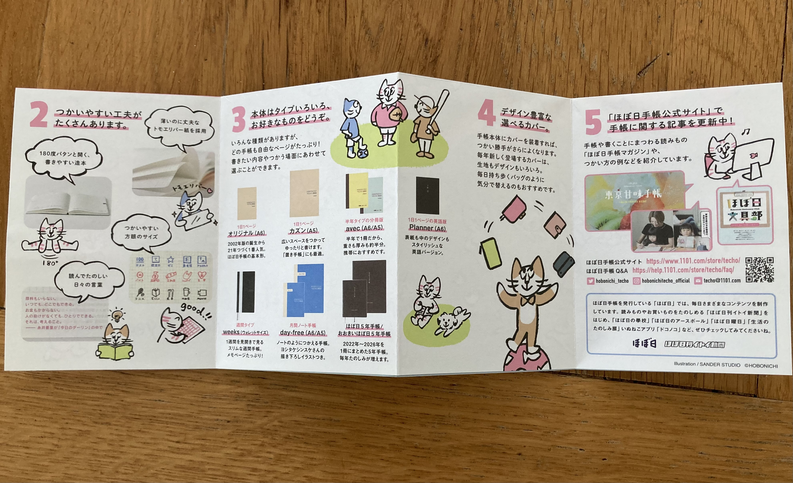

I've looked at them a few  times over the years but never bought one. They are pretty expensive - I guess from import duties etc. from Japan - and, you know, it's just a  notebook. However, I saw that the 2H 2022 ones were up for pre-order at a local online store and so I went for it. Being half the year means that it was maybe half the price.

Look on reddit or forums or  wherever and people rave about the quality and paper and how nice they  feel. Again, something I didn't really buy when reading about it online. However, I'm now in that camp of "ermahgard this is the nicest notebook I've ever had."

The paper feels smooth and is remarkably well  suited to just about any pen and ink type you have. Even the cover feels nice. A lot of people get covers and holders for their technos, which  do offer benefits such as pen holders and extra pockets for cards or  tickets etc., but the vanilla notebook seems durable enough to keep it  bare.

It comes in A6, which I initially thought would be too  small, but now I appreciate the small size, as it makes it easy to bring back and forth to work or anywhere else I want to take it.

The  biggest difference to most other notebooks, even ones with fancy paper  and covers, is the prescribed layout inside. There are a lot of sections inside it. It's similar to a diary but there's more than just days of  the week. There's a year index, a month calendar, the individual days, a timetable, a top 100 list, favourites list, contacts, and probably a  few other things I've forgotten. The individual days have the date, the  moon phase, time slots, a meal journal, and a todo list part. There's  just so much in it but it's all very well organised and laid out.

Whilst there's a general way to use each section, you do have the freedom to  do what you want. I like using the yearly index for a habit tracker, and the top 100 list for a book tracker. I've only just got mine so I might change these or find other uses.

I could do all this with a  blank notebook, and one at the fraction of the price. However, I quite  like being told what to do. Like the defaults in software, good ones are well thought out and you'd be wise to at least try it that way.

My half year doesn't start until 1st July, so I'm only partially using it  right now. I'll see how I get one once the month rolls around. I think  it could be just what I'm looking for, or it could be that I'm  romanticising a heap of paper.
