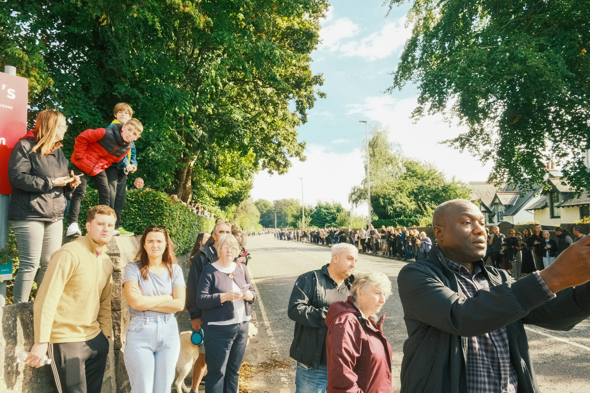
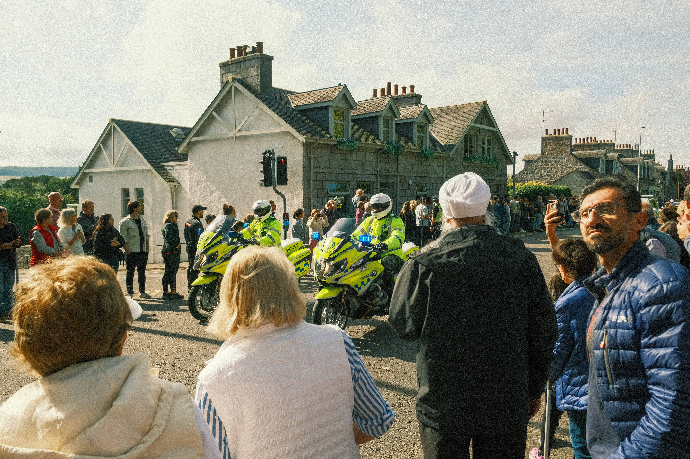
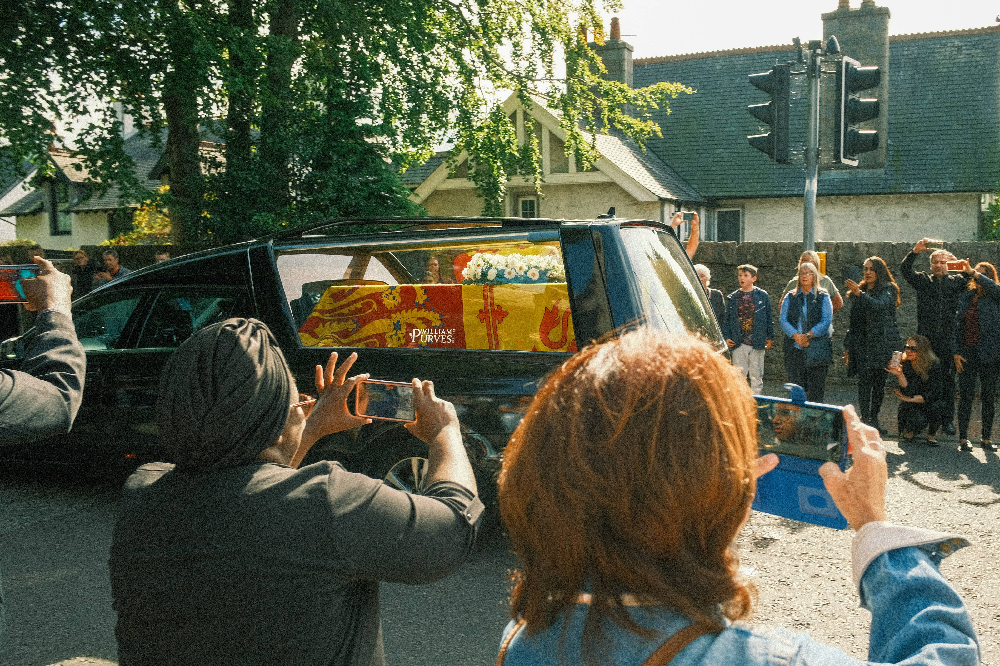

The Queen is [travelling](https://www.bbc.co.uk/news/uk-scotland-62862148) from Balmoral Castle to Edinburgh, and goes along the main road that's a 10 minute walk from our house. Couldn't really be easier to go.

There were, unsurprisingly, a lot of people. There were also a lot of police stationed every 100 metres or so just to keep people on the pavements. The road wasn't closed the whole time, and so people were still trying to drive around but it would've been a nightmare.

We could see the TV helicopter in the air and used that to guess when they were getting near. A whole procession of police bikes, vans, and cars all came by first. Then the Queen, and then the Royal Bentley with the Princess Royal and her husband Vice Admiral Sir Tim Laurence. They weren't going that slowly at our section and it was over in a flash. If you'd turned away you'd have missed it! A huge number of Range Rovers and other vehicles, police, ambulance and others all followed.

