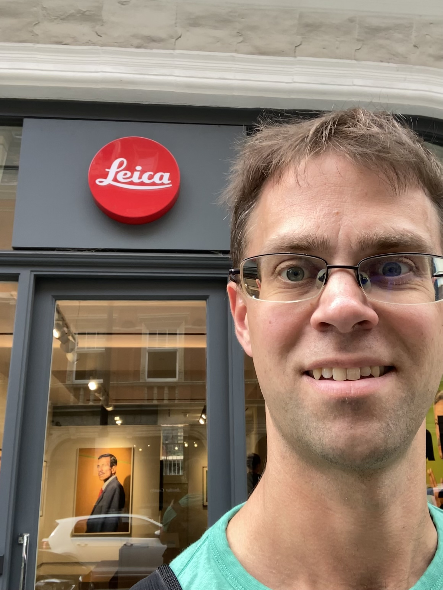
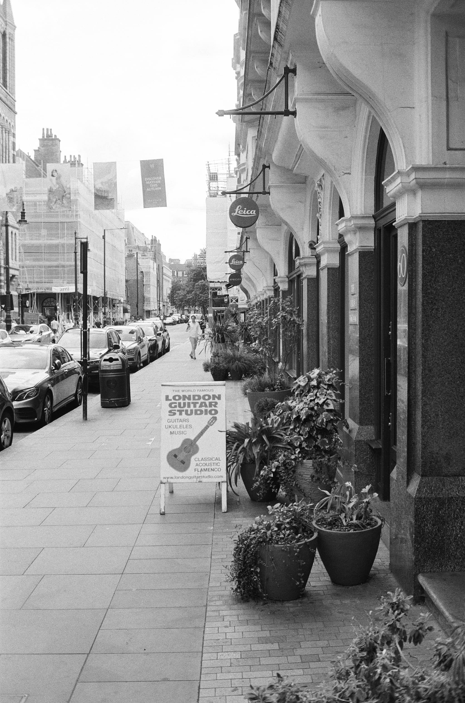

A few weeks ago I was passing through London and thought I'd take the opportunity to visit the flagship Leica store of the UK - London Mayfair. If you've played Monopoly, you'll know this is the expensive part of town!

It was quite the store. Display cabinets with all the cameras and lenses - M, SL, Q. There was a gallery and various display cabinets. I could've spent hours there, but unfortunately I only had about 20 minutes between trains.

I wanted to try out the M10, and I asked the white T-shirt'd hipster looking attendant if they had any I could try out. They only had a display M10-R as supposedly everything else was back at Wetzlar being looked over. I tried it with the 35mm summilux that was attached to it when he brought it out and then with the 90mm tele-elmarit I had with me. It felt exactly like holding the M2, it was unreal. The viewfinder was so bright and clear. It was lovely, and at that moment I was convinced I needed to get one.

But when I got home, and looked at the prices, that certainty started to dissolve.

