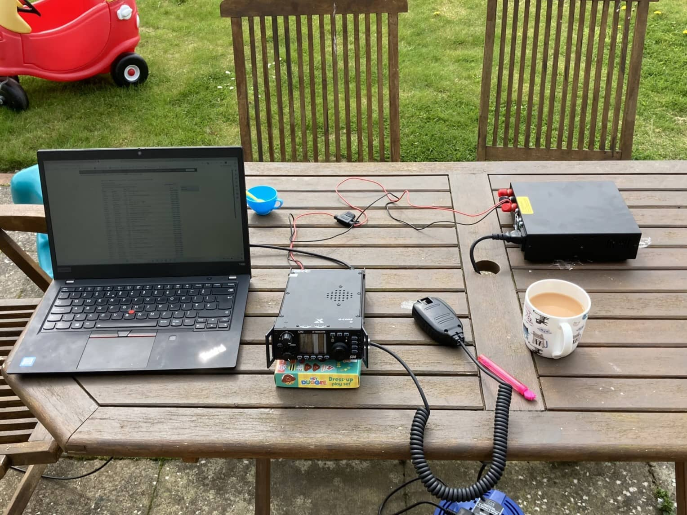
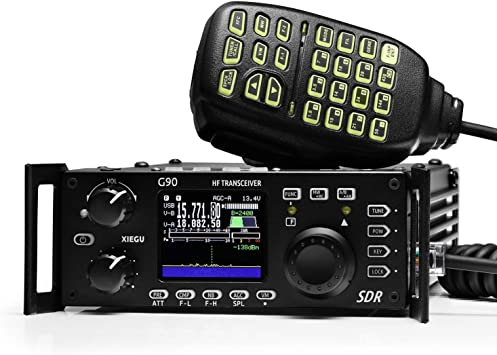
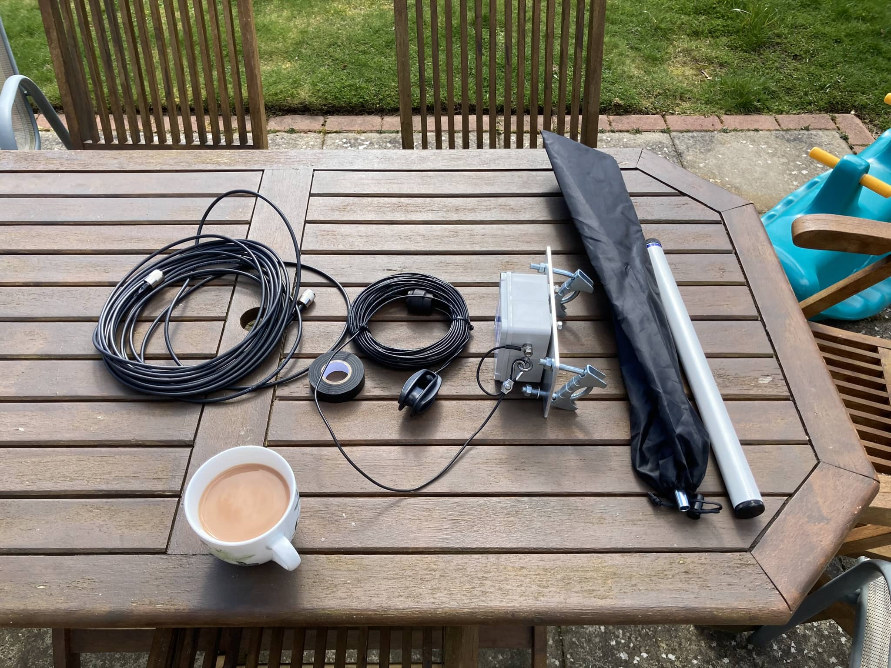
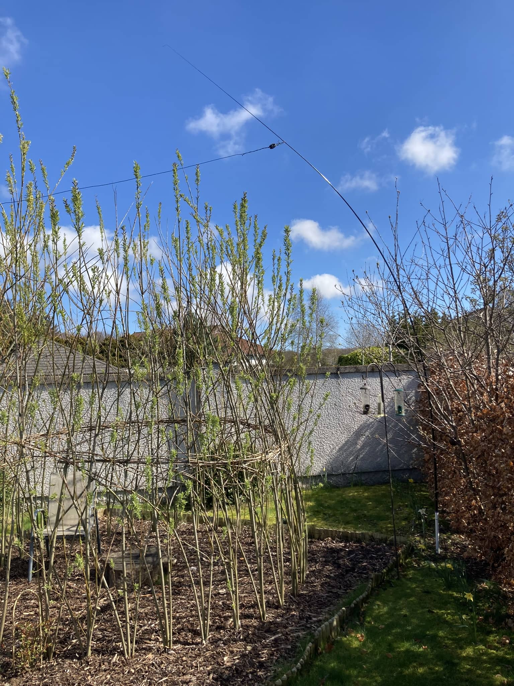
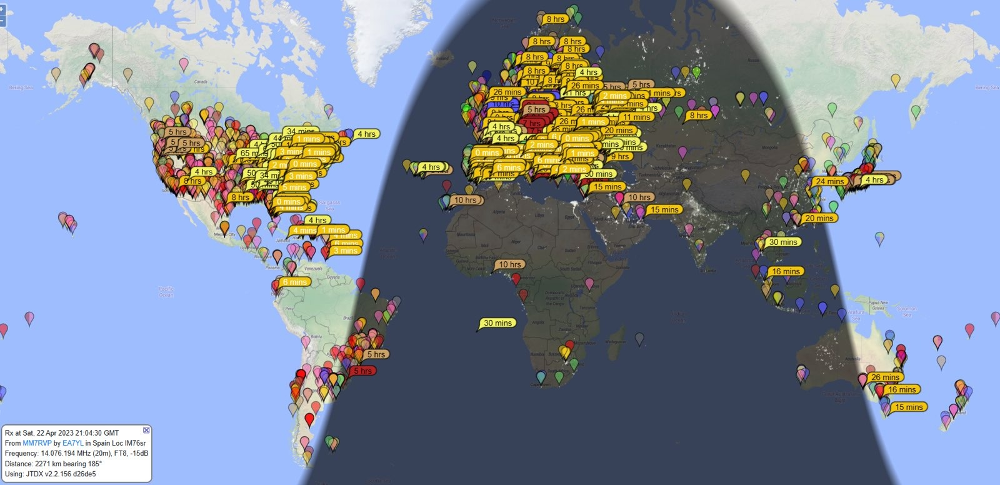

Several years ago, when we were living in California, I started thinking about getting my amateur radio licence. I don't remember why I started on this, but it seemed like something I'd enjoy and be interested in. I didn't end up doing anything, as you had to sit exams at test centres and it wasn't convenient. I soon forgot about it and did nothing more. Last summer, the same thoughts occurred to me again, not sure why, but I started looking into radio. This time what it takes to be licenced in the UK.

All that resulted in passing my foundation licence in December 2022 in the online exams by the [RSGB](https://rsgb.org/). I'd spoken to a friend about it in the summer, and he got interested. We both did the Essexham foundation training course, which runs online for a few weeks. He ended up passing first, which encouraged me to get on with booking my exam.

The content isn't difficult, but there's a lot of specific things you just need to remember. The exams "don't have trick questions" but often have word games or a particular way of asking questions which can make them harder than you'd think. I probably should've read the foundation manual as well.

It took until January before I actually got my licene from ofcom, the postal strikes and christmas holidays meant it took a while. I then got to pick my callsign online. There weren't many options to pick from and so ended up with something that, to me, sounded reasonable - MM7RVP. My callsign is M7RVP, but being in Scotland means I have to put in the other M. People in England don't have to use any letters (except for intermediate licence), which is a little annoying but I suppose the UK couldn't have too many designated letters.

I then did nothing for 4 months. Well, not nothing but I didn't use my callsign on the air. I mostly debated what I wanted to buy - if anything. Radio transceivers (transmitters and receivers in one) aren't that cheap. Probably not a high volume electronics item like computers and TVs, so are still pricey. Used gear is cheaper but after the initial depreciation, they then to hold their prices well. My friend and I were in the same boat, what do we get, is it worth it etc. He did buy a VHF/UHF setup, which is good for local contacts, but what's the most fun is HF. HF is the frequency range (3-30 MHz) that can go all around the world in the ionosphere.

Like most electronic things, there is no one perfect device. Perhaps the £10,000 one could be classed as that, but it's £10k and therefore not perfect 😅. We both had a similar shortlist of radios and spent many evenings debating the trade offs of them.

One day I saw one on the UK's used [ham radio forum](https://www.hamradiodeals.co.uk/), and that sold it for me. It was in great condition and I could easily sell it for what I paid for it, £350, if I needed to. I bought a Xiegu G90. This is a chinese brand radio, has a small but usable screen with a waterfall and does 20W on the HF bands. My foundation licence only allows 10W so it's ideal. I was all sorted. Well...with a radio, I still needed an antenna.

Picking a radio is very easy in comparison to picking an antenna. I think you never really pick one, you just make one, try it, and then make more and try them. Maybe you find some are better than others, or maybe they're just different. I don't know yet, as I've only had one so far but picking that was tricky.

There are so many factors in picking an antenna, and it really depends on the space you have and what you're willing to do. My aim was easy to install and would be decent enough to get me going.

To cut a long story short, I went with what's called an end fed half wave (EFHW) antenna, for the 40m band and up, making it 20m of wire. It works well on many bands, and the internal tuner on the Xiegu even gets a couple of others out of it.

Armed with a big mug of tea, I was ready to put up the antenna. I would attach to the balcony on the first floor, and to a pole at the end of the garden. Or so I planned. Turned out the pole I bought was quite weak and bendy.

The pole is 6 m tall but with the flex, the antenna was only about 3-3.5m off the ground. (I later read it would be better to thread it through a loop on the pole and tie it off on the ground, so that the pole wasn't taking the full horizontal force. I did try that, but it wasn't much better.)

I thought I could raise it up by tying the pole to the nearby tree - this tree is unfortunately still quite small else I'd have used it in the first place.

A little too much force it seems...I took down the pole and ended up tying the antenna to the tree, whilst the tree is small it could still hold the weight of the line and I could get it moderately high. I ordered a space section, so the pole will be for a portable setup that I'll make one day.

The antenna is about 4m off the ground at the house end and almost 3 at the tree end. Not the greatest but will do. The closer it is to the ground the more signal is absorbed by the ground and the higher the remaining signal gets sent into the air. This isn't great for long distance as a lot of the signal will get lost or only do one bounce in the atmosphere. However, to get it higher I'll need some serious pole solution.

So how has it been? Pretty fun! I've spoken to people all over Europe, into Canada and the USA. I can often hear signals from all around the world - Falklands, Australia, Japan, Indonesia, South Africa, etc. - but they can't hear me.

I've used the digital mode, FT8, which means I connect my computer to the radio and it communicates with other computers via radio. This doesn't need nearly as much signal compared to noise to make a contact compared to voice contacts. The best part is that you can look up online (on [PSK Reporter](https://pskreporter.info/)) who has heard your signal. So you don't need to make a contact with them to know how far your signal has gone. I've been heard across the world with this, and have made real contacts with Australia, Brazil and Japan.

Digital is nice to do whilst doing something else on the computer, and it is fun when you see someone far away has heard you, but by far the most fun is talking to people. Sometimes it's a quick signal report and move on, and other times we get into chats about gear (most often) and local things going on. Often I'll listen to others chatting and enjoy that just as much. Each evening you go on, you never know who's going to be there and who's going to hear you (the signal propagation relies on solar activity and is different each day on each band). I could (and have!) spend hours on the radio. So much so that I've not had time to do anything else - no photography, no blog posts, not finished the mac mini G3 build, and probably plenty of other things.

I did manage to tear myself away from the radio to study for the intermediate licence - this is the next level in the UK system and lets me use 50W and a few more bands. I passed this a few weeks ago, and so have a new callsign, 2M0RVM. It takes a while to get used to saying the new sign and sometimes I mix up the old and new, especially the RVP vs RVM. Maybe I should've picked something completely different but I liked the sound of RVM, and finding a free one is tricky, there isn't an up to date list anywhere (even the last freedom of information request list from January 2023 was significantly out of date).

Now I'm debating the antenna situation. Pole or not, a vertical, something else. My wife isn't keen on the wire going across the garden but equally doesn't like the sound of a 10m pole! I have started to look into satellites too, at least a dish is more discrete. I'm also thinking of setting up a portable antenna for trips away.

Plus I have the full licence still to get. 📚
