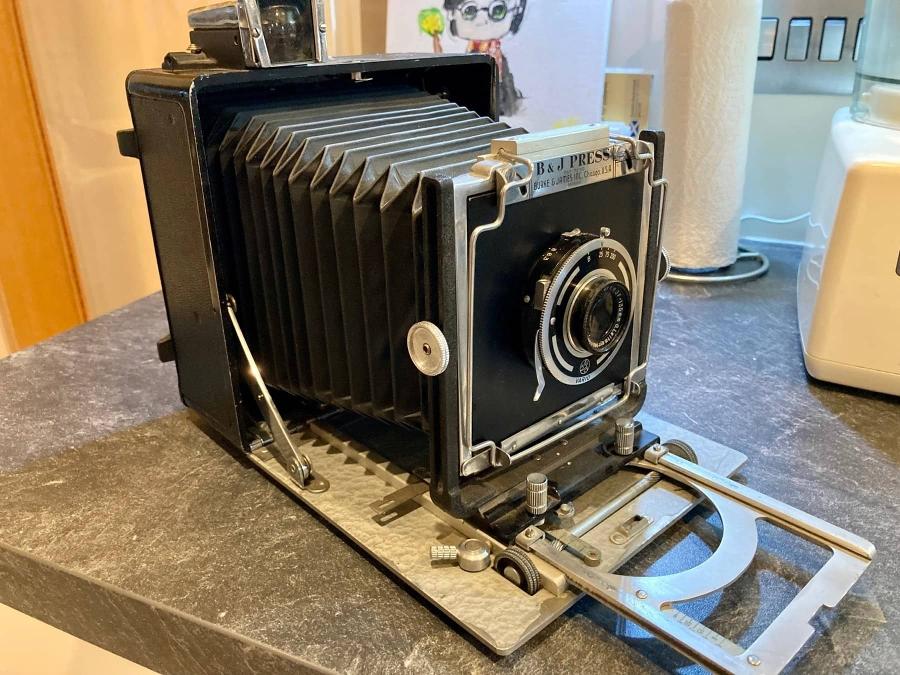
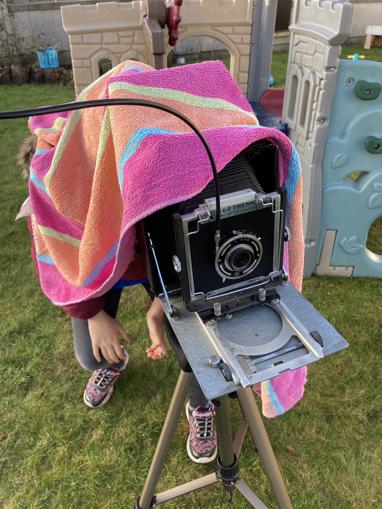
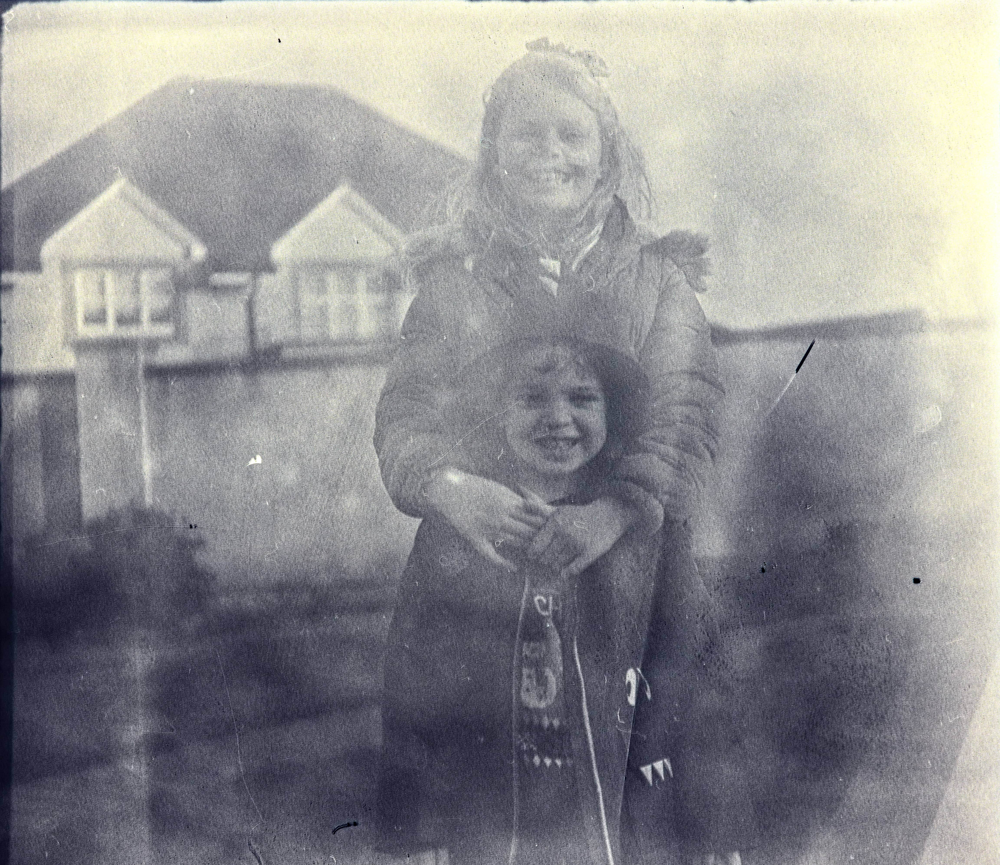

I've been meaning to write this up for the last 14 months! I also took a lot more photos for this post but I don't seem to be able to find any...🤷

A while back, in 2021, I was making a [wiki note](https://wiki.alexjj.com/#LargeFormat) on large format cameras, specifically 4x5 cameras. Jack noticed this and asked me if I would be interested in his [B&J Press camera](https://wiki.baty.net/#Burke%20&%20James%20Press%20Camera). Very generous of him! Postage to the UK wasn't the cheapest, but it was still far cheaper than trying to find anything here.

This is a 4x5 camera, meaning it takes 4x5" film. It just uses one sheet at a time and it is a VERY manual process! With so many steps from what you see to a photo, that if you get it right the sense of accomplishment is beyond words.

It took me a few months before I mustered up everything I needed, plus the commitment to actually use it. I got a box of Fomapan 400 sheets, loaded them into the film backs in my dark bag and proceeded to try and take a picture of *something*.

I took it into the back garden and took some (two) photos of the house and then of the kids. Amazingly they stood still long enough for me to faff about and take the shot.

Up to this point, whilst I had been taking film photos, I'd never developed anything myself and had just been sending off the film to labs. Now with 4x5 this is a lot harder as it's great big sheets that you can't expose to the light. I'd have to post off the whole holder, and that did not seem very reliable, plus the cost was tremendous. So as well as doing my first 4x5, I was also doing my first home development...in trays!

I set it all up in the bathroom in the spare room, it has no windows and I thought it would be a good location. All the trays were filled and I was ready to develop. It's quite strange (and very uncomfortable) sitting on the floor for 20 minutes whilst trying to develop these sheets. I also realised that, after adjusting the the darkness for 20 minutes, that the room wasn't as dark as I thought it was. Oh well.

My some miracle of beginners luck I did manage to make a photo!

Technically, it is absolutely terrible, and look at all those scratches and uneven developing marks. However, I love it.

Unfortunately, it would end up being the only successful photo I've managed to make with the B&J. I tried it again and everything was black. Somewhere, something is leaking light and I'd need to do a lot of investigating to figure out exactly what is the problem. Is the film I bought sealed from the light? Is it the film holder? Is it the camera? Did I develop it correctly? And maybe some others. I did buy a special developing tank for the 4x5 to make it less painful to develop.

So for the past 14 months, the B&J has made a nice shelf decoration with my camera things. I enjoyed using it, and I'd like to do it again, but maybe when I have more time. It's definitely one for the retired/kids have left home timeframe!
