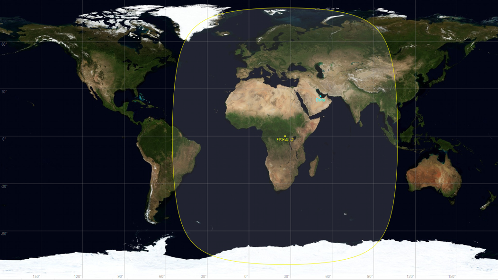

I think I first heard about QO-100 when looking at a [local amateur's QRZ page](https://www.qrz.com/db/GM0NRT). He'd setup a couple of satellite dishes in his garden and had his [QO-100 DX Club](https://qo100dx.club) logo on his profile page, along with some other links. That started me down the rabbit hole.

Briefly, and there's more details [here](https://amsat-uk.org/satellites/geo/eshail-2/), QO-100 is the name given to a geostationary satellite that sits above Africa and has amateur radio transponders. This means it's always in the same place, and can be used by amateur radio licence holders to make contacts across its coverage. Being in such a high orbit means it has a huge area of coverage, so you can contact anyone in this area and talk to them for hours without the worry of propagation changing and losing contact.

Another thing that makes this interesting is that it has both narrow and wide bands. This allows for voice, Morse and simpler digital modes on the narrowband and then on the wide band amateur television! So people can broadcast video via the satellite, there's even a weekly net by the British Amateur Television Club (BATC), and they save them to YouTube. Doing video broadcasting requires a lot more equipment and power, and is maybe a step too far for me.

The satellite has been in orbit for about 5 years, so there are a lot of tutorials and guides online on how to get setup, together with people making items that help get connected. The main ones I found useful where [DK1MI's](https://dk1mi.radio/qo100-pluto-sdr/) and [other one](). My setup is basically the same as theirs, which I'll explain shortly. There seems to be two approaches to getting on the air with QO-100, one is via a SDR that can transmit as well as receive and the other is a transverter that takes you transmitter's 2m or 70cm output and ups it to the send frequency. As I don't have a 2m/70cm radio, and the location of my dish is not conducive to using a radio, I went with the SDR option, as that means everything can be housed in a box underneath the dish and all I have to run to it is power and ethernet. 

Like most satellites the uplink and the downlink are on different frequencies, in this case it's an uplink of 2.4 GHz (think wifi) and downlink is 10 GHz. The downlink is fairly easy, as a LNB (think Sky dish) can receive it and converts it down to 700 MHz range.

## My diagram of setup