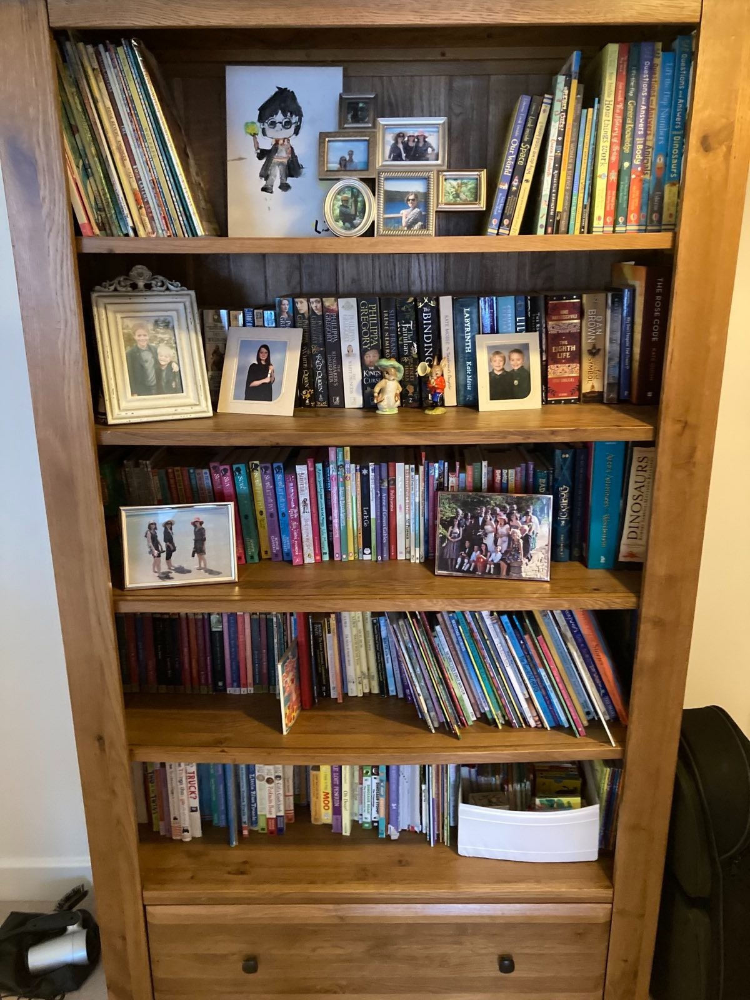
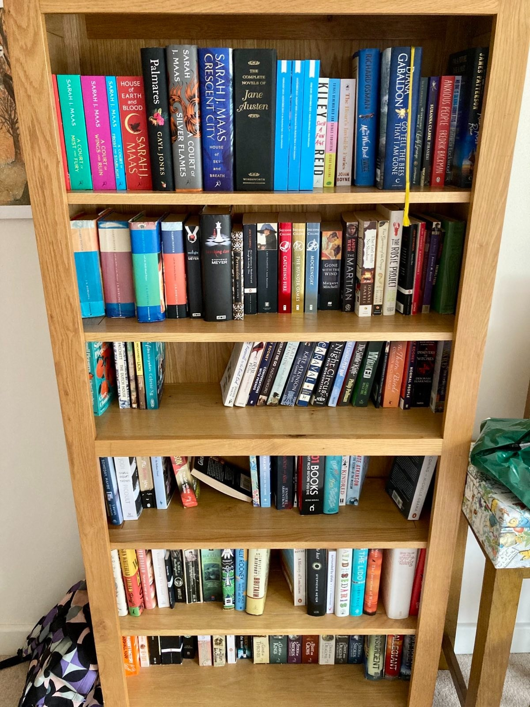
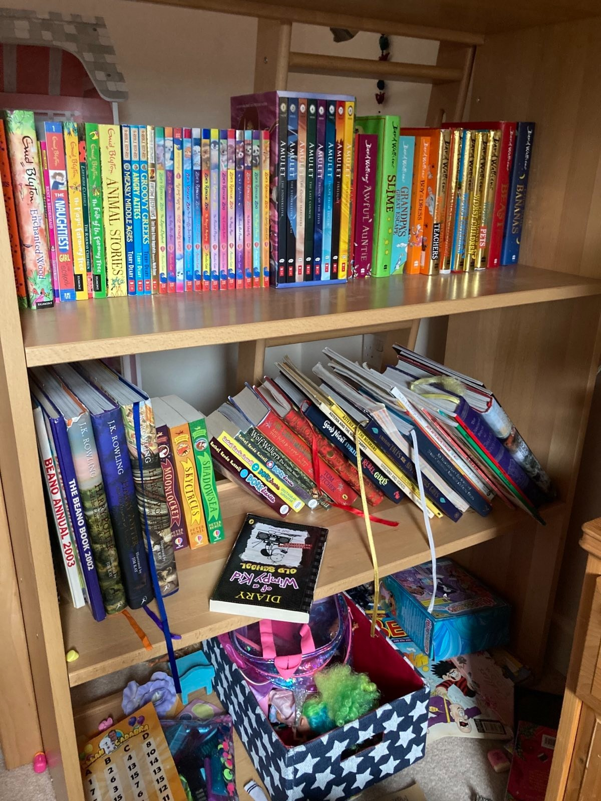

Book cases, book shelves, whatever you call them, I am drawn towards them. It is always interesting to see what people put on theirs. Both the books and also the trinkets or sundries. It's such a big collection of stories, both contained within the book but of the person that owns them. What is the journey that this book has come along to get to this shelf? What did the reader think when they got the book, when (if) they read it? Where is the book going next?

If you're lucky you have space, and shelves and books to together, and then you get to chose what goes on them, and where in the house these books should live. You get to pick the order in which they're stacked on the shelf.

Or maybe these decisions have never been made, and just the natural flow of life has resulted in books on shelves with the same choosing that results in driftwood on a beach.

Some books have obvious places to live. Kids books in or near kids rooms for bedtime stories, or for them to hide away from the world and enjoy the quiet company of a book.

Recipe books in the kitchen.

