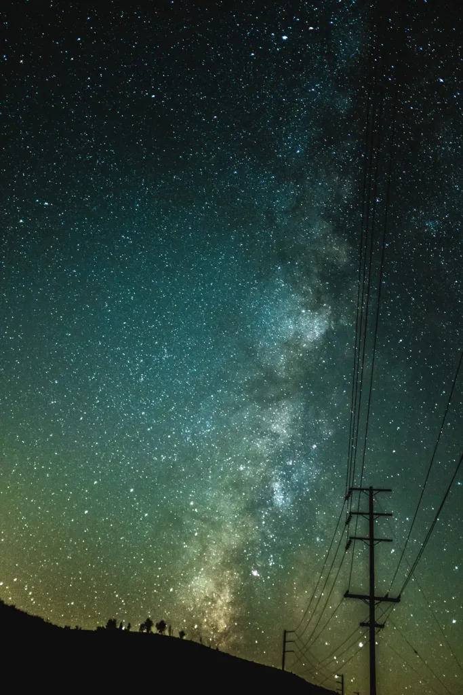

If you visit the Fujifilm House of Photography in London, somewhere on the walls you’ll find a photograph that I took.  *Afraid it's been taken down now, and lives at home with me!*

I had some friends who were keen to go astrophotography shooting and  invited me along one evening. We drove out to the mountains and tried  several places to take pictures. Prior to going I’d done a little  research into how you actually take photos of the sky at night. At the  time all I had was the Fuji X100F with it’s 23mm f/2. This turned out to be a good lens, it’s fast and wide-ish. If I had the WCL that would’ve  made it a 18mm f/2 and perhaps even better, however, I didn’t so I just  used what I had.

We took quite a lot and it was hard to tell if  anything was good or bad or what. This particular one was taken near the main highway just off some side farm road. It was so dark I couldn’t  see anything and just aimed the camera on the tripod in the general  direction. I probably couldn’t have lined up the telegraph wires better  if I tried! This was back in 2017 and we had a good night and finished  it with a stop at a MacDonald’s on the highway for hot chocolate. I also got the photo printed to give to one of my friends who went with us  that night as a leaving gift.

Fast forward to September 2020, and [Fujifilm announced the 10th anniversary of the X100 series competition](https://web.archive.org/web/20201219100036/https://fujifilm-x.com/en-gb/special/X100anniversary/). You can submit any photo as long as it has been taken with a X100  series camera. As most of my photos are of family and friends, I didn’t  have too many that might be suitable and this astro shot was the one I  immediately thought of. The first prize was a brand new, shiny X100V.  They had multiple first prizes for different regions, so I wasn’t  competing against everyone, just everyone in the UK!

The following February I got an email saying I was one of the 10 runners up! Woohoo!  🎉 (although would’ve been nice to win the camera given I’d just  recently sold my X100F and was missing it a little bit 📷). My prize was a nice tote bag, and a hand written congratulations note. The other  part was that they would print and display the photo in their gallery.

Except then COVID had locked everything down and they decided to postpone it a few times. However, now the gallery is open! Unfortunately, I live a  long way from London and I’m not going there any time soon, so I won’t  get to see it in person. They have offered to post it up to me after the exhibition, so that’ll be nice.

The Fujifilm store looks like a  nice play to go if you like photography and cameras, they always have  gallery one and no doubt lots of toys to play with.

I believe ~~it’s~~ was open now until 30th June 2022. [Have a look at their site.](https://fujifilm-houseofphotography.com/)

*Update: They've since posted the framed version to me at home. Now I just need to decide what I'm doing with it.*
