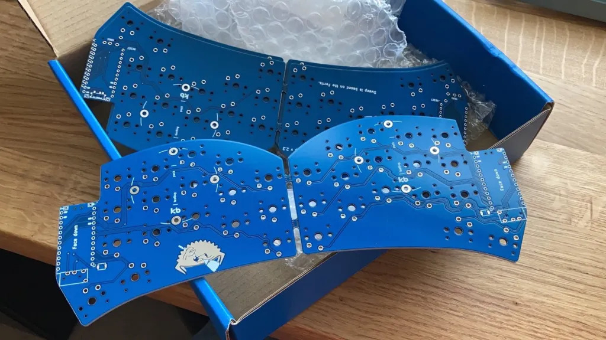
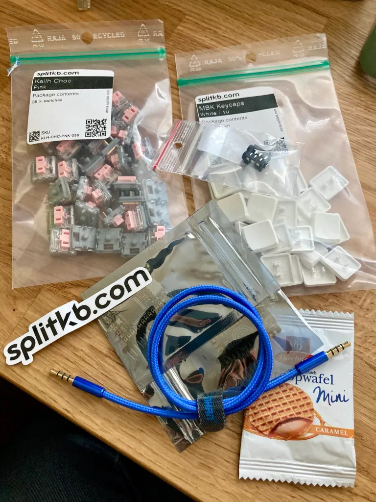

It’s been a long time since I last built a new keyboard. I think it was Christmas time 2018 when I bought the [Iris keyboard](https://keeb.io/products/iris-keyboard-split-ergonomic-keyboard) as the store had a sale on. Funnily enough that was a split keyboard. I keep meaning to write up a post about all my mechanical keyboards  (there’s been quite a few over the past nine years) and I’d enjoy going  back and remembering what I had.

Mostly what happens is I buy a  new kit or PCB thinking it’ll be the end game (after much research),  build it, configure the layout, generally mess about, and then stop  using it. After a few months I end up selling it online, probably to  fund the next one. Building is a fun part of it, so perhaps nothing  wrong with this cycle. Will this next one be any different, or have I  just been distracted by film photography and other things the past 3-4  years?

## The Ferris Sweep

That’s the name of the [new keyboard](https://github.com/davidphilipbarr/Sweep) I’m going to build. A friend sent me a video of it a while ago and I decided I absolutely needed it. It’s a derivative of the [Ferris keyboard](https://github.com/pierrechevalier83/ferris), but instead of various individual components on the board, it makes use of a microcontroller. This means it’s a lot easier to build and  microcontrollers are pretty common across mechanical keyboards. There  might be some other changes too but I didn’t spend much time looking at  the Ferris.

The final parts just arrived and so I’ve yet to build  it, the featured image is one like what I’m going to build but I went  with blue PCB and white keycaps. It was pretty easy to source, the  Github repo has a .gerber file which you can upload to a [PCB manufacturer’s website](https://jlcpcb.com/) and they’ll print them off for you (minimum of 5). It’s remarkable, and pretty cheap – $20 for 5, and then $15 for postage and taxes.  Unfortunately that’s where the cheapness ends. Now this is by no means  an expensive keyboard on the scale of mechanical keyboards, but it’s not nothing. The rest of the parts – controllers, switches, caps, etc. –  soon add up and whilst there are a lot of stores that sell these parts,  not all of them have everything you need – least not ones in the UK. I  ended up ordering everything else from [splitkbd.com](https://splitkb.com/). This store is based in EU and does have excellent stock – just it’s a €25 postage, so make sure you have everything you need!

I went with [Sweepv2.2](https://github.com/davidphilipbarr/Sweep/tree/main/Sweepv2.2) and pink Kailh choc keys, these are the lightest pressure ones. The next thing will be to solder it all together, [flash the controller](https://docs.qmk.fm/#/) and get typing! Well, try typing. Making a new layout will be the  longest part, likely involving many iterations if I truely want to stick to it.

Will I stick with it? You never know! 😅

### Update 31st July 2022

I build it, flashed the stock firmware and tested it out. All but one key works. Probably need to check the solder. However, that's as far as I  took it from back in May. It's sat on my desk reminding me that I wasted money on it. I have just sold one of the spare PCBs on ebay, so that  gets a little money back. I've forgotten how much I did spend, maybe  about £90 in total.
