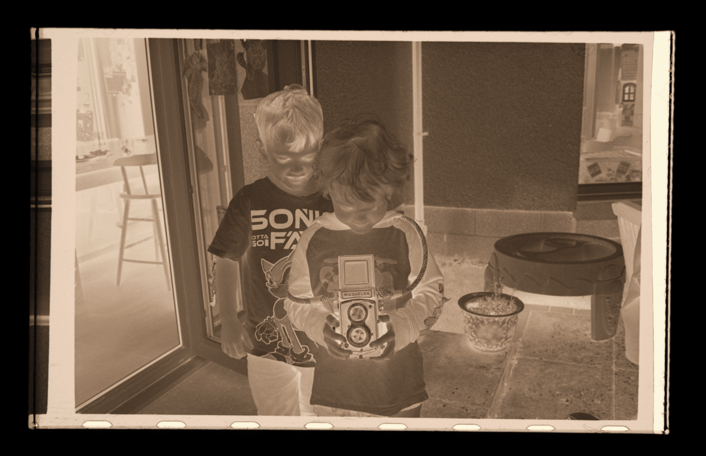
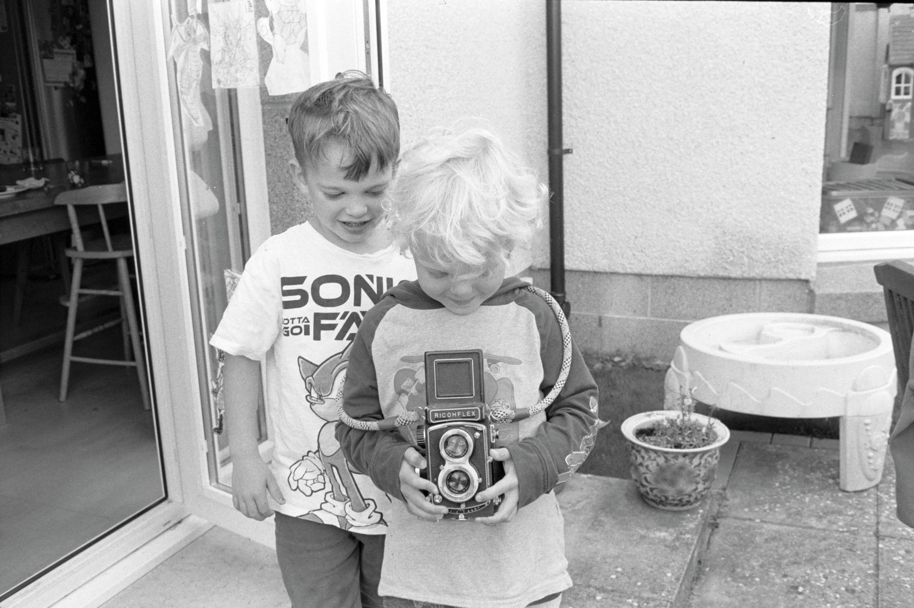

A few weeks ago I managed my first successful attempt at film development. Whilst I was very excited that it worked, the next thing was actually seeing the images. I did take a tiny picture of several frames using my phone and the filmdev app. That was fun just to see that there was something.

The next thing is making larger images. My two choices were scanning onto the computer or dark room printing. Unfortunately, I don't have a darkroom (although I do want to somehow make one in the garage), so scanning it is. When I scanned my grandfather's slides I used a dedicated 35mm/slide scanner. The Plustek 8200 or something, together with Silverfast AI. The scanner is slow, the software is very weird, but once you figured out the routine you could steadily work your way through them all. In my wisdom, I'd sold the Plustek after finishing the slides - actually made money on it, which when I then came to look at buying another realised that this is because the prices are going up, and still going up, for used models. Another option is a flatbed scanner, but those are quite expensive and sounded more annoying for 35mm.

The final option is using a digital camera. As I have a digital camera, this did seem the more sensible option. However, you do need quite a few other things to make it all work. Namely a tripod or stand, light source, macro lens, and something to hold the film/black out around it. Like all things you can spend a fortune on any one of these items. I tried not to but the macro lens was never going to be cheap. I went for the Fuji 60mm f/2.4 as I thought it would also be useful as a mid-range portrait lens. I've never used it for that but I still might. However, having used it for scanning I'm not sure I like it for that. I've found manual focus is more reliable and helps speed up the process once it's dialled in and the 60mm's focus by wire isn't that great. Perhaps I'll look to sell it and get a manual focus one - assuming it's a net cost to me.

Back when I did my first development on 4x5, I tried a cheapo camera stand thing and a home made, black card mask. The mask was actually fine but the  tripod stand thing was absolutely terrible. Wobbly and hard to adjust. It went straight back and I shelled out for a reasonable tripod. I had to find one that let me rotate the pole around so the camera can be mounted underneath. This is much more stable, secure and makes it easy to keep things parallel. For 35mm I think a home made mask might get tedious, so I went with an [essential film holder](https://clifforth.co.uk/). This gets lots of great reviews online, and as far as holders go it's a cheap one - although still £75...

The fold out screen of the X-E4 is very handy for lining stuff up and changing settings. It flips the display when the screen moves past a certain angle which is ideal, it does mean the menu navigation is backwards but I can get used to that. I should make a preset for scanning so that I can get going quicker next time, as changing settings is a bit of a hassle as I then have to change them back later. I think I've messed up one of my presets so I'll have to check that next time I'm using the camera. The macro lens isn't quite long enough to get the film to completely fill the screen/sensor, extension tubes could fix that, or a longer lens. Maybe 80mm or 100mm? It's not too big a deal as I just crop in post, which I'd do anyway. It also makes it quick to align as I'm not trying to hit it perfect straight away. Probably means my images are 12-14 megapixel vs. the cameras 26. Still plenty big enough.

I spent a lot of time faffing about with trying to do tethered photos with Lightroom on the computer. Eventually realised that my copy of lightroom needs a paid for add-on to do it with Fuji. I then tried Fuji's X Acquire but I couldn't get it to work. The instructions said to put the camera in a certain mode, but my settings didn't have that option, only for a webcam, so I don't know. I also tried using the remote app on my phone but it was too slow and awkward for focusing. I was concerned about camera shake, but I just ended up using the 2 second delay to take the photos. This worked well, except it makes a really loud beeping sound which annoyed my wife in the other room whilst she was watching TV!

Just to add to it all, my battery was very low and all the fiddling around I'd been doing meant it died after a few shots.

Once I got the first image in focus with peaking and zooming it, I could quite quickly move between frames and capture the whole roll in not much time at all. I think with a scanning preset setup on the camera, next time should be very quick.

I then spent ages fighting with Lightroom again until I realised my copy, again, was too old and didn't support my camera's raw files. So that was the end of Lightroom. When I went to bed that night I realised I could use another program to convert the RAFs to DNGs and use Lightroom.

I have a copy of Capture One Express for Fujifilm, so I thought I'd try that out, as all the negatives are, well, negative, I need to invert them and crop them at a minimum before I have useable images. C1ex seems a little buggy as it would crash when I'd try and customise the menu bars but I soon found my groove with it. Probably all photo editors can do it, but copying and pasting settings, and everything having a keyboard shortcut made editing (once I got the hang of it), very quick. I probably spent 20 minutes on the first two images, and then 10 on the other 26. (I seem to only have 28 from my 36 roll 😕)

There are loads of film conversion tools out there and it's overwhelming. Either as standalone things or plugins to various programs - typically Lightroom, or Photoshop. Negative Lab Pro seems to be the most common/popular one, it's for LrC, but given all my heartache with Lightroom, I've not tried it yet. I think these plugins are probably most useful for colour negatives. Black and white is fairly easy. The common method of "flipping the curve", i.e. move the ends of the line to the opposite of where they start, does the job. I then cropped out the blank area, and film edges, hit auto, tweaked a few things like exposure and blacks/whites and the image is good to go! Then paste the settings to the rest and crop them.

I later found moving saturation all the way to zero ensured my images were black and white and didn't have some blue tinge from the white balance setting. Usually auto was fine, but sometimes I had to use the white balance picker to find a suitable white part to get it right. I did scan all the images upside down, so next time I can fix that.

I'm pleased with the results, and it's nice to have done the whole thing from exposing the photo, developing the film to scanning and processing it myself. Now that I've done it once, and know what I'm doing, and together with some pre-configuration of camera and setup, I think the next roll will be pretty quick to do. As long as I've charged the battery first!
