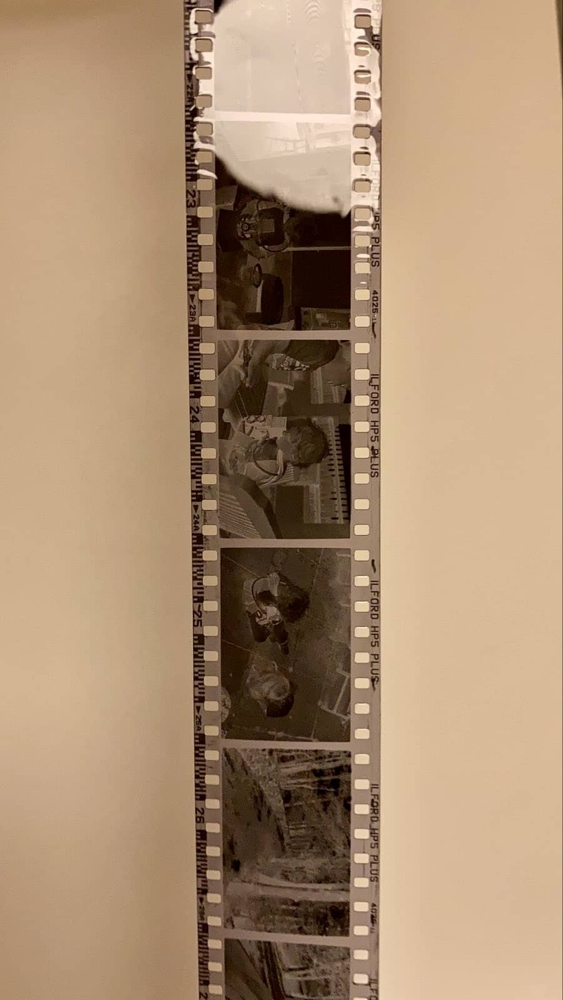

After the previous attempt, where I concluded the developer had expired, I was determined to continue. First I had to purchase some new developer. I decided to go for Kodak HC-110. This appears to be a classic developer from the beginning of time and it's high dilution ratio and long shelf life attracted me to it. Initially, I thought it was more expensive than the Ilford ilfosol 3, but that's because I didn't notice I was buying 1 litre of HC-110 vs. the 500 ml of ilfosol (the pictures are the same size on the website 😅), and even with that obvious difference the dilution means the HC-110 wins out. I also took the opportunity to get some photoflo - this helps avoid water marks. Hydrophobic solution or some such. I found water marks and drying a pain when doing 4x5. The 35mm is a lot smaller but one less thing to deal with is always nice. The HC-110 does have a lot of warning labels on it, much more so than the Ilford. Perhaps that's just for the US market or perhaps it really is much worse for the environment? The whole development process does seem to be not great for the environment, I feel like I use a **lot** of water. I'm sure there's ways to improve this and I'll look into it more.

Last time I had to figure out how to open the canister without a fancy tool, and so this time I got straight in and ripped it open like a hungry bear opening a dumpster lid. However, this time it took me *forever* to get the film onto the plastic development spool. Literally 45 minutes. I was tucked into my dark bag, absolutely sweating, fiddling about trying to get it on and to take. Once it did go but then seem to get stuck half way and wouldn't go any further. I had to then unwind it and start all over again 😢. My wife was out and I daren't take my arms out of the dark bag whilst the film was completely exposed inside, and I was wishing I'd setup my iPad or phone next to me so I could try and get Siri to start playing a video of loading a spool. But then somehow it just worked. It wasn't perfect, the last little bit didn't quite seem to go on, and so I tucked it in myself. Phew...all loaded, and now I could start the actual development! Seems like not perfectly dry plastic spools can have this issue. Although does make me interested in [stuff like this](https://analoguewonderland.co.uk/products/lab-box-the-35mm-daylight-loading-film-tank). [Video explainer.](https://www.youtube.com/watch?v=fa1SGQQwNXQ)

I've made a [permanent place now](/notes/film) to write my instructions so I won't forget, but doing it in practice is quite different from reading about it. I used a tiny measuring cylinder for the HC-110, but then rinsing the developer into the larger measuring cylinder was a bit of a hassle, I might use a syringe next time. I'd made up all the stocks. I am using a stop chemical - people tell me they just use water, and probably I will in the future - but as I have it and it's getting a bit old I might as well use it up. I'd bought some new fixer as well. The Ilford one I have as expired according to the label and so I didn't want something else ruining it. The Adox one gives you a choice of dilution and seemingly it just means you wait longer...so why wouldn't I go for the more dilute one?

The stop and the developer are both this pale yellow colour when made up, and I'd placed them in the order I'd use them on the side of the sink. I'd also put a thermometer into the developer to stir it and see what the temperature was - seems our utility is a bit colder than the rest of the house and was only at 18 °C. However, what I hadn't noticed was that my labelled measuring cylinders were the wrong way round - I have one I've written 'dev' on and one with 'stop' on (also one with 'fix'). I'd made up the solution into the wrong one! Not a super big deal but after I'd poured in the developer I noticed and then that got me doubting I knew exactly which was which! If I was really worried, I could've poured it out, washed a lot and then started again. However, I was fairly confident because of the thermometer...

Time past, agitation was applied, and then the gallons of water was washed over the film. I dipped the spool in the photoflo (that'll last ages as 200:1 dilution! aka a drop), and then lifted it out to see what happened...

I was overjoyed to see the development had worked. No blank or black or something film, just lovely little 35mm frames all the way along. In my excitement I wasn't paying attention to how I was cutting them up, and instead of strips of 6 it was all over the place with 4, 6, 8...all sorts! The photoflo seemed to work well as the water just ran right off them whilst hanging up to dry.

So that was yesterday, and by the time it was all done, it was time for bed! Now the next mammoth effort, which is scanning them in. I think I have everything I need, although still deciding upon what software to use. Everyone seems to love negative lab pro, and I've downloaded the free trial to test it out. It's just that it's another $100 on something. All this stuff...there are lots of free things, or just instructions for Lightroom, and the open source editors like GIMP or Darktable all do it to some degree. What I would really like to do is make a contact sheet, just so I can look at them quickly and see what's what. I had a quick mess about with the Film Dev app on iOS and laying a couple of strips on my light box. That actually works out pretty well just to see what you have. I could do with a holder or a transparent storage sleeve to hold them in. Annoyingly I just bought some 35mm storage sleeves two days ago, but I'd just gone for ones with opaque tracing paper style back, mostly as that's what came up first and I have them already from films done by the lab. Now I see there are just as many transparent ones, which are probably more useful to have in the long run for going back through all photos. Even more annoyingly is that they went up in price on Amazon TODAY! Only a couple of quid, but still it's yet another thing to buy 😅. Here's the quick shot I did, mostly pick the strips at random but I quite like the four slide montage of individuals.

It was quite an ordeal but makes the photos all the more enjoyable. All in all, I'm very happy with it. I'll get to scanning them all at some point but I'm happy not to send B&W away to the lab now (although I still will for colour). Am I now going to be 100% film, and blasting through multiple rolls a day...probably not, but now I won't think quite so hard as to whether whatever we're doing is enough to justify a roll of film.
