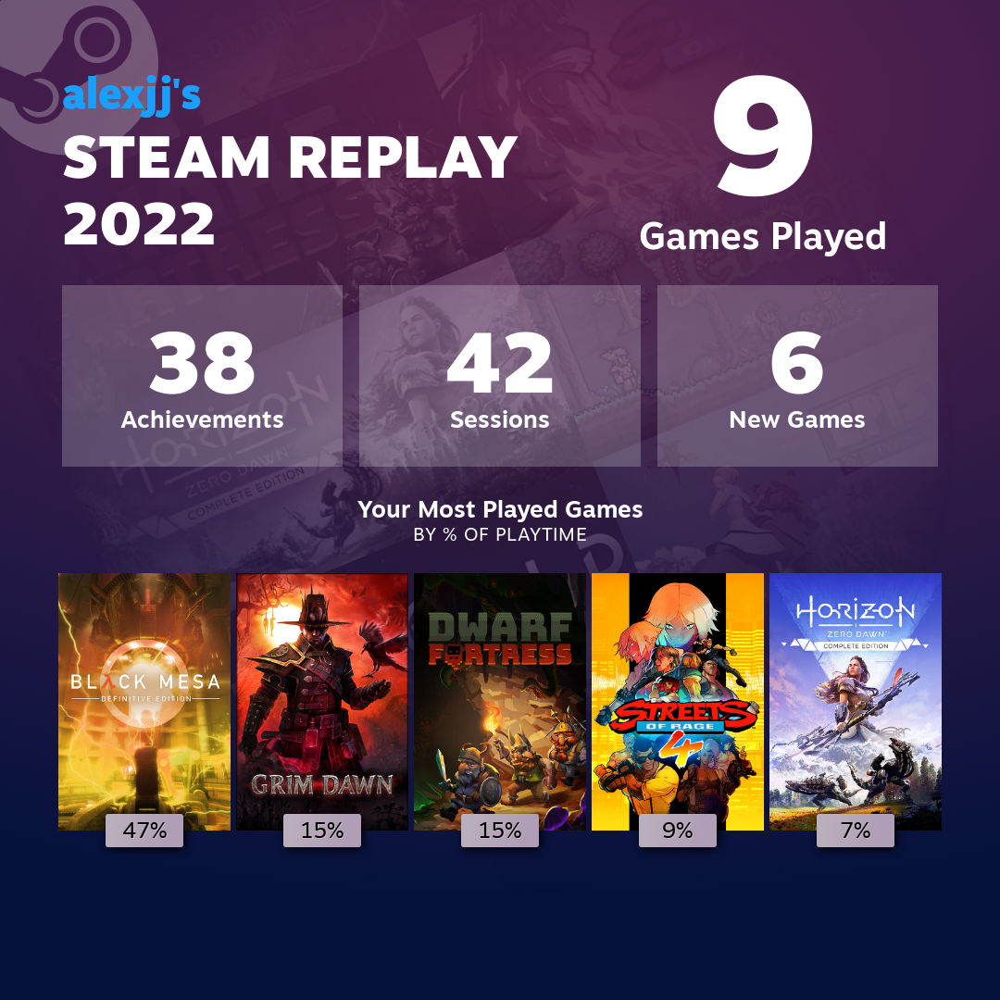
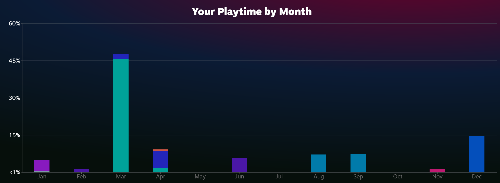

Annual recaps seem to be the trend in social media and apps. It's quite interesting actually. Reddit did one, which told me the scary number of hours I've spent on the app. Including spending 25 hours on /r/leica 🤫

Steam now do one and shows me how much time I spend on games. I knew I didn't play that much but I was surprised by how little I did actually play!

I played Black Mesa, the Half-Life 1 remake in the HL2 engine, in March this year for just shy of 20 hours. My friend and I played Grim Dawn, think Diablo 2, in August and September for about 15 hours. We also played Streets of Rage 4, a remake of the Sega classics from the 90s. This was a disappointingly short game at 3.6 hours. It was fun but I'm sure the originals were much longer. That, or we just used to play them endlessly as penniless kids.

I've tried to play Horizon Zero Dawn a couple of times. Not sure why I've not got into it properly. It's a nice RPG story game, but seems to have a unique storyline which looks interesting. It's quite old now, and so often goes on sale. I picked it up at the start of the year but didn't properly play it until June (if you count 3 hours as properly). I think that was a bit before our summer holidays and so when I came back I'd forgotten the controls and what was happening so didn't continue. Then the longer I left it the harder it was to restart. I've been thinking about it recently but yet to start.

I actually want to play more games in 2023. I enjoy playing them and it's a good way to relax if I'm tired from work. Feels like a better use of time than randomly browsing the internet, or spending another 25 hours on certain subreddits!

To finish the year, I've been playing Dwarf Fortress. I've been playing this game for years...I don't remember exactly when I found it, but I think around 2011. It's been free forever on their [website](https://www.bay12games.com/dwarves/), but they just released a version on Steam this month. It has a new UI and a little bit more approachable. I've you've not heard of it then you're missing out on some internet game lore. It's a game made by two brothers that they started in 2002. They have been making this game as their full time job since then (or maybe about 2006) and living off donations. It is a simulation game and is detailed beyond anything ever. At the same time the original graphics are just ASCII characters. [Wikipedia](https://en.wikipedia.org/wiki/Dwarf_Fortress) can do a better job of explaining it than me.

I bought the Steam version, partly to support them and partly because it has a new UI. With christmas and everything I've not played much, about 8 hours, but it's one I plan to continue into the new year.
