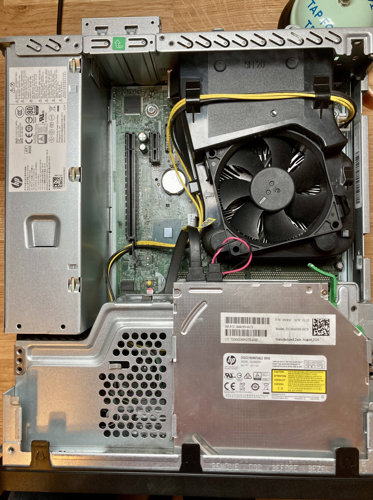
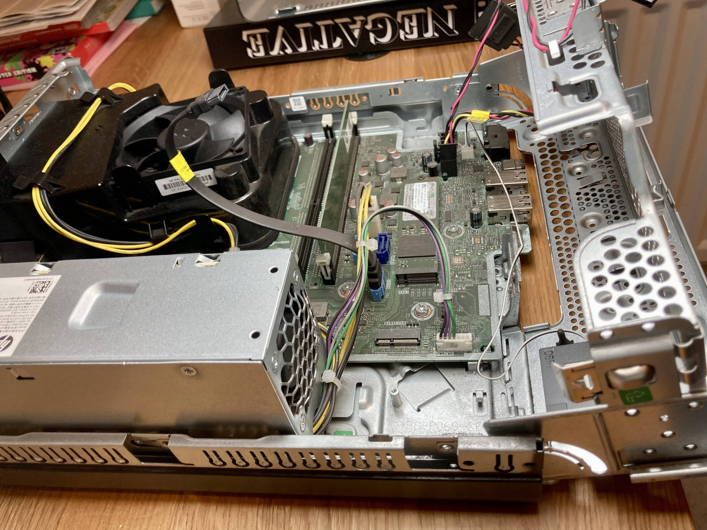

I'm referring to used prebuilt computers, and not laptops...all of those are prebuilt. Things like HP or Dell or Lenovo desktop or server machines. I do quite like them. They offer good performance at a good price, and generally there are loads of them available. They're typically ex-business machines and have enjoyed a comfy life in an office. They usually have good CPUs and if you're lucky you can get decent ram and SSDs in them already. Being for businesses they tend to have great accessibility to the insides, often being designed nicely to access bays or replace parts. They often have nice hard drive bays, perfectly sized cables tucked in just right, and they often have specific power supplies that are compact, and efficient. Some of them only make 12V which makes them really efficient. Cooling is usually well thought out, and with nice ducting and rubber grommeted fans to keep vibrations low.

I'd say if you're looking for a general purpose machine, either desktop or server, you can't go wrong with some line of these machines. There are a lot of models and series over the years. Price reflects this but with some research, or just filtering by CPU you can find what you need. Modern CPUs are ridiculously powerful and will be fine for many years.

If you go for recent models, like 10th gen intel, then the power draw by these machines is tiny on idle, but then you still get a 8 or more threaded CPU when you do hit the gas.  These machines often come in multiple sizes, from tiny chassis up to basically full size towers. Space and expansion obviously aligns with the size, but if you just need laptop innards but in a desktop then the tiny models are great. If size is a concern then the tiny or not-quite-so-tiny desktop models may be a great selling point for you. Like a NUC but without the premium price tag to go with it.

So why wouldn't you buy one? Generally these are designed for businesses and as such graphics performance tends to be poor for gaming or ML /GPU intensive work. That's not to say you can't get models with GPUs or larger cases have space for them, but then the power supply tends not to be sufficient. Expansion of these machines tends to be quite limited. This is of course dependant on your perspective. As you can still get 64GB of ram and 1-3 storage devices (NVME, SSD, HDD), and a PCI-E expansion card (depending on the model). So be sure to know what you want before you buy it, as it's not as flexible as a regular desktop. Little things like using special power supply connectors on the motherboard means you can't put in a new PSU to enable running a bigger GPU, or some SATA slots are weirdly slow as they're only meant for DVD drives. There aren't extra SATA power cables for another drive, even if you could stick it somewhere.  The motherboard is a weird shape or size, so you would struggle to move it into a regular case - because you wanted to expand it.

If something fails then it might mean the whole computer is done. If you're lucky there are parts on ebay or somewhere. This is probably just the motherboard and PSU, with PSU being the most annoying if it failed.

## My experience

I've owned 3-4 of these over the years and they've all been great. Again, that price vs. performance is hard to beat. You get everything for the same price as maybe buying a motherboard and CPU - even used parts. I think the older ones were generally more compatible, and the newer ones have more proprietary connections and designs. However, if you research them carefully (they all have maintenance manuals online) and get what you need, I see no reason not to get one.

My latest one is a HP ProDesk 400 G7. It has a 10th gen intel i5, and came with an 8GB stick and a 256GB NVME. It's the small form factor (SFF) so has a 1x and 16x PCI-e slot, and has space for 2x 2.5" drives, or 1x 3.5". Currently it has a DVD (maybe writer) in the slot. I wanted a new server that was lower powered when on idle, and a newer intel CPU to take advantage of the Quicksync transcoding feature for plex. There are multiple G series, one for each intel gen. The price for the G7 seemed worth it to me. According to the manual it should idle at about 5W (pre-any drives I assume),

This is replacing a previous prebuilt of the Lenovo TS-140. I actually bought that new as there was a really good cashback offer on it, which made it a fraction of the price. Maybe even $150 or something. This came with a 4th gen i3 but I upgraded it to a Xeon 1246 v3. It has served me well, and is still perfectly fine, however, it idles at 50W and can't do h265 natively. It does, however, have space for 4x 3.5" drives (with a bit of an adapter in the 5.25" bays).

I currently have 4x 4TB WD Red drives in a ZFS RAIDZ1 array, so usable storage of about 12 TB. I don't need 12 TB, although I have used a lot. We've tried to tidy up but there are a lot of old movies that we had on DVD or even VHS that we've kept. Many don't get watched but it's hard to part with them. So perhaps I shouldn't have got a machine that can only house one drive....

Right now I'm thinking that I could just get one drive for the new server and have everything on that. I'll keep my existing drives, either in the current computer or maybe look for a cheap 4 bay housing thing (tbh the current computer is probably the most sensible option other than it takes up more space) and use it as a pure NAS that turns on ~once a week for backups.

With the price of power going through the roof, I've been driven by power consumption. It does come with trade offs but I tend to find that I can easily live within constraints when they occur, and is in fact a better approach than designing for all eventualities. Although I'm still guilty of fixing things that aren't broke!
