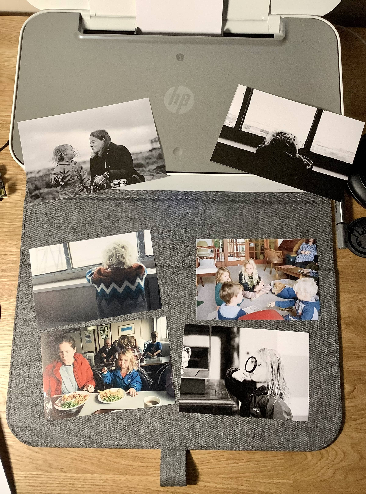

Print out your photos. Please remind me to do this. It's so fun to hold them in your hand and look at them. You really study them when they're there and it's not a queue of 200 images to get through.

Doesn't need to be a fancy printer, or perfectly colour matched. Just print them out on whatever you have. Don't have a printer? [Get one of these](https://www.canon.co.uk/printers/selphy-compact-photo-printers/) for immediate fun! Although a little pricier than a regular printer per photo. Or take advantage of the numerous offers online to print a bunch of 4x6s.

These have been sat on my desk for a couple of days and the kids came in and all started looking at the pictures. We had fun talking about them and remembering the trip.
