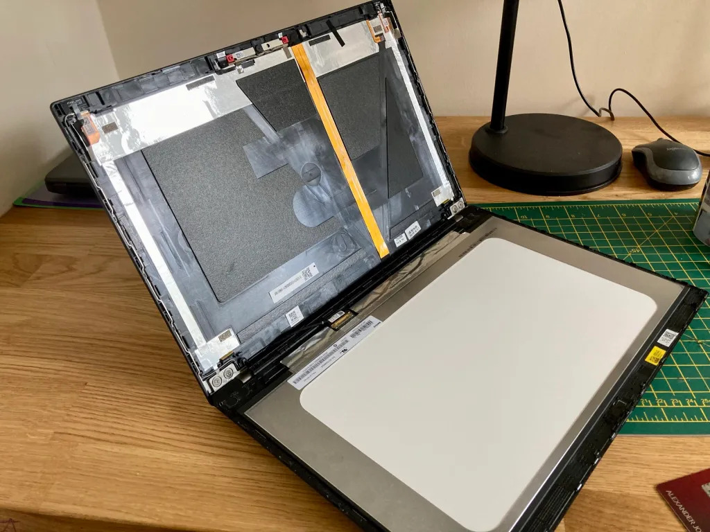
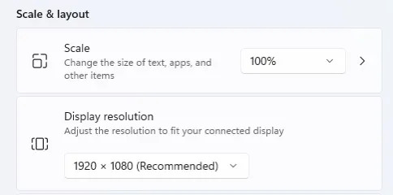

A while back I decided I  needed (yes, needed) another laptop. I do have a Thinkpad T450s already  but my daughter has pretty much taken it completely and uses it for  school work. So I went on the hunt for a new one. I wanted it to have  USB-C so that I could use my existing dock and setup at home that I have from working at home with my work laptop.

I started trying to figure out which model was the oldest I could get,  but then saw that I should try and find one with the 8th intel cpu (or  higher) as these were the low powered quad core CPUs which had a much  bigger performance boost compared to previous generational increases.  This meant T490(s) or 6th gen X1 Carbon (2018). It was pretty easy to  find out that the T490 was the cheapest, and offered the most ports and  expandability.

I found a bargain on eBay but lo-and-behold the  screen was a horrible 1366×768. I thought they stopped selling laptops  with such dire screens. But no, and in fact you can still get models  with them today from Lenovo. I later rechecked the listing and it  conveniently didn’t specify anything about the screen resolution.

I had the choice of sending it back and buying a new one, (or sending it  back and not getting another as why do I need six computers in the  house), living with it, or upgrading the screen. I did upgrade the  screen of my X230 about 5 years ago and that was pretty easy. It looked  like buying a replacement screen would be the cheapest. Especially if I  can sell the old screen to recoup some money.

Finding the right model to get was pretty straight forward. A quick visit to [/r/thinkpad](https://old.reddit.com/r/thinkpad) and searching for screen replacement so led to finding out which model is best to get. There’s also [this review](https://www.notebookcheck.net/Lenovo-s-Panel-Lottery-continues-with-3-different-14-inch-LowPower-displays.426538.0.html) of screens by notebookcheck. Supposedly it’s the Innolux N140HCG-GQ2,  and this is what I bought from an interestingly named store of  Softhands.co.uk. I’ve just noticed there’s a B1 version but don’t know  if it’s better.

There are a couple of videos on [YouTube](https://www.youtube.com/watch?v=ZvAkA-QuD4E) showing you how to do it, and even some videos by [Lenovo](https://support.lenovo.com/gb/en/solutions/ht508135). Like all ThinkPads there’s the [service manual](https://download.lenovo.com/pccbbs/mobiles_pdf/t490_p43s_hmm_en.pdf?linkTrack=PSP:ProductInfo:HarwareManual) which has a lot of good information for any upgrade or repair you might want to me.

I used a small screw driver to start separating the bezel from the lid  and then a metal credit card to separate it further. There are a few  sticky parts that need pulling apart. You need to apply more force than  you think to get it to separate.

Detaching the cable is the fiddliest part. There’s a catch to lift up and over  and then the connector slides out parallel to the main board towards the lid. I have some pointy nose tweezers that helped with this part.  Getting this back in when reassembling is equally fiddly and you need to make sure it goes all the way in so that the two parts are flush  together.

The first boot and the Lenovo logo appeared but then it  all went blank. Oh uh! I restarted and went into the BIOS – the screen  was working fine again – poked about in the settings but there wasn’t  anything to do regarding the screen so I restarted and, Success! Windows booted and I could change the resolution to 1920×1080. 🎉

There  is a balance between screen area, resolution and pixel density. I find  native 1080p a good balance between them on a 14” screen. A higher  resolution and everything gets too small to read. You can up the scaling but then you start to lose space, also I find non-integer scaling, such as 1.5 or 150%, can sometimes lead to funny text or other UI  annoyances. It’s been a while since I tried, so I’m sure OSs have  improved this. You can avoid this by going with a 4K screen and doing  200% scaling, and it looks lovely, probably also because the panel has  full colours and great brightness.

So if you have a low resolution screen, I’d definitely encourage you to look into replacing it  yourself. Now I’m off to install Linux on it! 🐧

