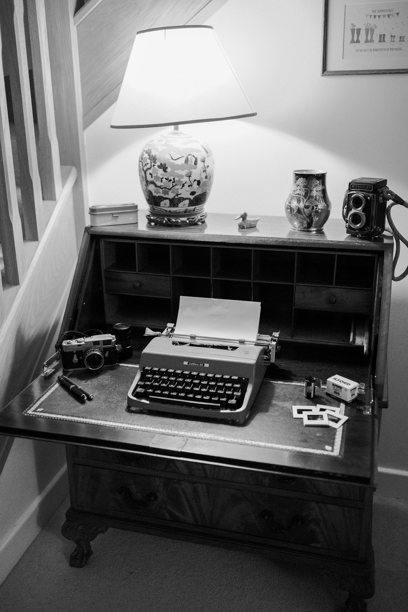
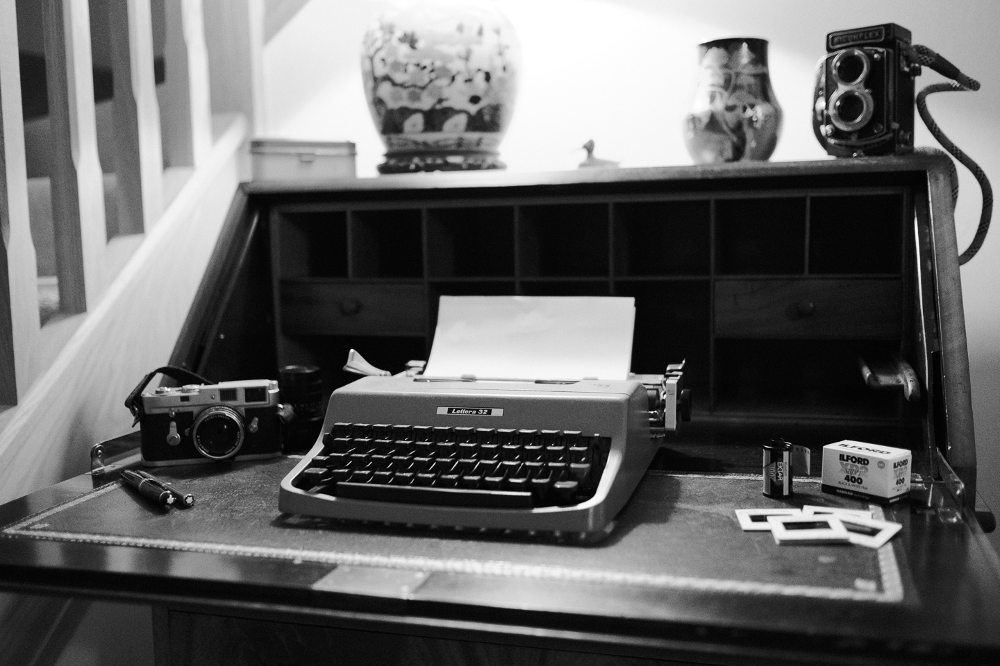

I have to admit my previous [one](https://alexjj.com/posts/2022/a-little-writing-nook/) has become overwhelmed with things that there is no longer anywhere to write. It is now home to radio books and magazines, a few other books I keep meaning to read, a [Hobonichi](https://alexjj.com/posts/2022/hobonichi-first/) I've yet to write in, and more. I keep meaning to tidy it up.

We recently inherited a nice bureau from my wife's grandparents, and her mum kindly brought it up to our house. We also got various little knick-knacks, house items, recipe books and consumable things like notepads and sewing stuff. Still to find homes for it all but the first thing I wanted to test out was the bureau.

I'd actually forgotten it had drawers at the bottom, which is slightly disappointing as I can't tuck a chair under it when not in use, but they are very handy for storing paper and notebooks etc. I even think I could store the Olivetti in one. That would be ideal. Even though I like having the typewriter out in the office on the desk, it does take up a lot of space.

By far the most exciting part is all those cubbies for trinkets and mysteries! My nanna used to have a bureau in her house, and as a child I remember finding it open some days and just poking about in all the little sections. There were so many things packed into it. It also contained all her correspondence and home admin, just nothing was organised, at least not how any of us could see. It was in the dining room, and so when it was dinner time she could just close it up and everything looked tidy, even though behind that door was a mess of papers and objects.

Hopefully we'll keep ours a little tidier than that!

The office refurb we did was, and still is, great. There is so much desk space available for all sorts of things at the same time. However, it's where the computer sits and boy is it hard for me to sit down in the office and NOT go on the computer. It really takes a lot of effort to write with a pen or the typewriter and I've essentially done none in a long time. Amateur radio has also been a big cause of doing nothing else but amateur radio, but even before that I was doing very little. My best periods of writing where when we were on holiday this summer, where I wrote everyday. There, I'm out of my routine and there's no autopilot sit on the computer.

Now with this new writing nook, away from the computer, my intent is that I will reestablish my routine. The only issue is that it's in the hallway, and so everyone will hear the typewriter, but that's a minor detail I can work around...probably by getting everyone some ear plugs for christmas.
