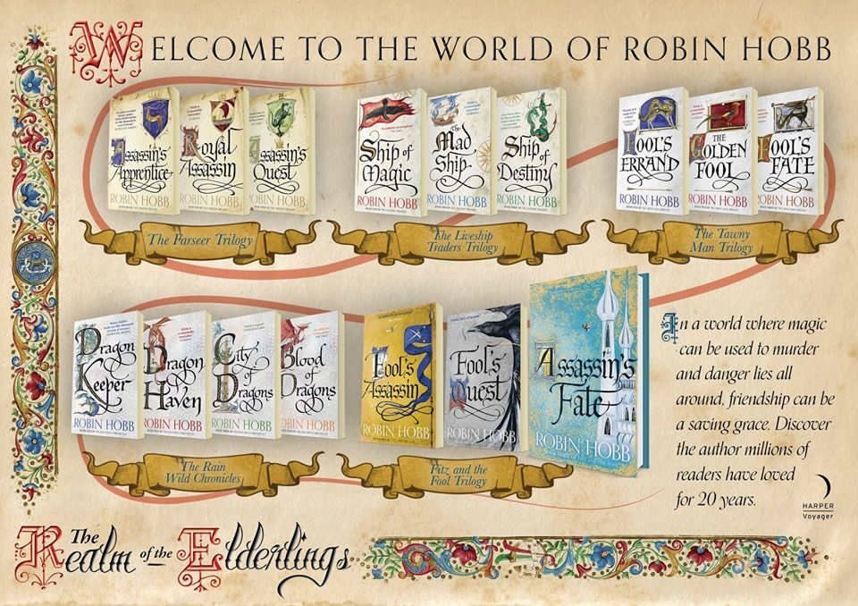

Last night I finished the final book in the series...at about 2am! It's a fantasy series set in a medieval style world with magic and dragons written by [Robin Hobb](http://www.robinhobb.com/) (a pen name of Margaret Ogden). It consists of 16 books in five trilogies (one is a trilogy in four parts (tetralogy ?)), and has in the region of 4 million words. It's like Game of Thrones, except it's not brutal and miserable! First published in 1995 and finalising in 2017, it is quite the epic.

I started at the beginning of 2023 after just finishing re-reading Lord of the Rings, having not read it for around 20 years. I pretty much only read the series in 2023 and powered through the last trilogy this year, after getting the books for christmas. I'm glad I didn't start in 1995 and have to wait 22 years to get to read the final one. I feel like I've been tired for the past year, either due to playing on the computer too late or not being able to put the books down when I read before bed...and sometimes both!

I do enjoy starting a new book when you know the world and the characters. New ones come along but it's so easy to pick up and keep going. It's probably why my [reading list](/notes/books) is full of series. Foundation, Discworld, Wheel of Time, The Stormlight Archives and so on.

I found [this website](https://thewertzone.blogspot.com/2021/10/the-longest-sff-novels-series-of-all.html) comparing the length of sci-fi/fantasy series, and this set is number two only to the Wheel of Time. It was surprising to see it above Discworld, with its 40 odd books, but they are more modest of length compared to the tombs that Hobb and Jordan write.

I don't really want to write a detailed review, as I'm not very good at it and there are some many better ones online, but I would recommend these to anyone who enjoys a good story. There's sadness and bad times but they do end satisfactorily, other than wishing there were more.

After reading nothing else for 14 months, I'm not sure what to start now. There seem to be lots of recommendations on reddit for Lois Bujold's The Chalion series, but perhaps they're too similar. If I want to go more sci-fi then I've been reading about the Children of Time series by Adrian Tchaikovsky. At some stage I do want to re-read the Discworld series. It's been about 16 years since I started that. However, I think I should try something new first.
